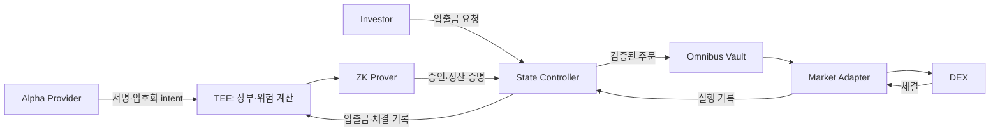

# Confidential Alpha Protocol

여러 운용자의 자금을 하나의 Vault에 모아 거래(ZkbookVault가 DEX에서
토큰 스왑)하되, 장부는 운용자별로 나눠서 비공개로 관리하는
프로토콜입니다. 해커톤 연구 구현입니다.

- 장부는 TEE 안에서만 보고 갱신합니다.
- 장부가 바뀔 때마다 ZK 증명을 만들고, Vault 컨트랙트가 증명을 확인한
  뒤에만 거래를 실행합니다.

명세 [`docs/specs/confidential-alpha-protocol-v0.1.pdf`](docs/specs/confidential-alpha-protocol-v0.1.pdf) ·
용어 [`CONTEXT.md`](CONTEXT.md) ·
진행 상황 [`docs/team-status.md`](docs/team-status.md)

> ZK 키는 로컬 단일 참여자 setup으로 만든 테스트용입니다. 실자금에 쓰지 마세요.

## 목표 구조



### 현재 상태

| 경로 | 위치 | 구현됨 | 미구현 |
|---|---|---|---|
| 다중 전략 MVP | `src/sleeves`, `contracts/sleeves` | 단일 Vault, 전략별 장부·지분·보수, 자체 AMM | TEE, ZK, 외부 시장 |
| 외부 DEX 연결 | `src/integration`, `contracts/integration/ApprovedVault.sol` | Monad 포크에서 Uniswap WMON/USDC 거래, 서명 승인, 체결 복구 | 메인넷 거래, ZK 검증 |
| ZK 장부 전이 | `circuits`, `src/zk`, `contracts/integration/ZkBookVault.sol` | 두 Book의 주문 예약·체결 정산 Groth16 증명, 포크에서 검증 | 입출금 지분, staking, 전체 위험 규칙 |
| TEE | `deploy/tee` | Phala TDX에서 quote 검증, 암호화 입력, TEE 내부 증명 생성 | TEE→DEX 전체 연결, 영속 장부 |

## 사이트 (현재 obsolete) 빌드 및 실행

요구사항: Node.js >= 22.13

    npm ci
    npm test            # node --test tests/*.test.js
    npm run build       # 프런트 -> dist/
    npm start           # http://127.0.0.1:8790

개발 명령어: `npm run dev` API (8790) / Vite dev (5173)

## 스크립트 실행

목표: 사이트를 이 스크립트가 하는거 하게 연결

1. ZK 회로

회로 컴파일 (`circuits/book-transition.circom` -> `artifacts/zk/`):

    npm run build:zk

- 오래걸림 (5분 정도)
- powers of tau(2^15), Groth16 setup, Solidity verifier 생성
- (note) 실행할 때마다 새 무작위 키 생성됨

```
book-transition.circom
      |
      +--(circom)--> book-transition.wasm
      |
      +--(circom)--> .r1cs --(setup + ptau)--> book-transition.zkey
                                                  |
                                    +-------------+-------------+
                                    |                           |
                             (export vkey)            (export solidityverifier)
                                    |                           |
                                    v                           v
                         verification-key.json            BookVerifier.sol
```

빌드 산출물:
- `book-transition.wasm`: witness 계산기, 규칙 위반 입력은 계산 실패
- `book-transition.zkey`: proof 생성용 키
- `BookVerifier.sol`: 온체인 검증기 (proof + 공개값 -> t/f)
- `verification-key.json`: 오프체인 검증 (verify:zk)용 키
  (BookVerifier.sol 과 같은 키, JS 용)

2. 포크 증명

Monad 메인넷 상태를 로컬 Anvil(chain 31337)로 포크해 실행

    npm run prove:external                            # 외부 DEX 연결
    npm run prove:zk && npm run verify:zk             # ZK 장부 전이 (build:zk 선행)
    npm run prove:omnibus && npm run verify:omnibus   # 자체 AMM 경로

| 환경 변수 | 기본값 | 용도 |
|---|---|---|
| `MM_MONAD_READ_RPC` | `https://rpc2.monad.xyz` | 포크 원본 RPC |
| `MM_FORK_BLOCK` | 최신 블록 | 포크 블록 고정 |

- 실행 결과 -- `docs/evidence/`
- TEE 실험 절차/비용 -- [`docs/tee-hardware-probe.md`](docs/tee-hardware-probe.md)

장부 상태 변화:
- `ledger(state = 0)`: 주문 전
- `ledger(state = 1)`: 주문 승인, 돈은 장부상 그대로
- `ledger(state = 2)`: 돈 들어옴

prove:zk (scripts/prove-zk-fork.mjs) 흐름:
```
+--------- prover (src/zk/book.js) ---------+   Rn = hash(ledger(state = n))
| ledger(state n) -> ledger(state n+1) <-+  |
|      |                                 |  |   phase 1: n = 0
|      v                                 |  |   phase 2: n = 1 (uses actualOut)
| [book-transition.wasm] -> witness      |  |
|      |                                 |  |
|      v                                 |  |
| [book-transition.zkey] -> proof        |  |
+------------+---------------------------|--+
             |                           ^
             |                           |  if phase == 1:
             |                           |    read vault.actualOut
             |                           |                      offchain
-------------| submit -------------------|------------------------------
             | (proof, Rn+1)             |                       onchain
             v                           |
+---------- ZkBookVault -----------------+--+   verifyProof(proof, public values)
| phase 1: authorizeAndExecute()            | ----------------------------+
| phase 2: settle()                         |                             |
|                                           |                             v
|                                           |                  +--- BookVerifier ---+
|                                           | <--- true/false  | check proof        |
|  true  -> root = Rn+1                     |                  +--------------------+
|          if phase == 1:                   |
|            swap                           |
|            actualOut = measured           |
|  false -> revert                          |
+-------------------------------------------+
```
1. phase1 (`authorizeAndExecute()`): prover가 만든 증명을 Vault가
   검증하고, 통과하면 같은 트랜잭션에서 주문을 실행 (스왑, 돈
   나감). `root = R1`
2. prover가 체결량(`vault.actualOut`)을 읽어 `ledger(state = 1)` ->
   `ledger(state = 2)` 계산 (스왑 결과는 이미 Vault 잔고에 반영된
   상황)
3. phase2: phase1 스왑의 실제 체결량이 prover 장부의 해당 Book에
   정확히 반영됐는지 검증
4. 통과하면 온체인 `root = R2`, 대기 (`settle()`) 해제 -> 다음주문 가능

- 실행 로그: docs/evidence/zk-book-fork.json

verify:zk (scripts/verify-zk-evidence.mjs):
- docs/evidence/zk-book-fork.json 의 proof 를 verification-key.json 으로 재검증

## 문서

- [`docs/team-development.md`](docs/team-development.md) — 상태 전이, 도메인 경계, 작업 분담
- [`docs/implementation-readiness.md`](docs/implementation-readiness.md) — 통합 구현 착수 조건
- [`docs/zk-transition-runbook.md`](docs/zk-transition-runbook.md) — ZK 증거 재현
- [`docs/external-integration-runbook.md`](docs/external-integration-runbook.md) — 외부 연결·TEE 운영
- [`docs/archive/`](docs/archive/) — 이전 명세와 README
