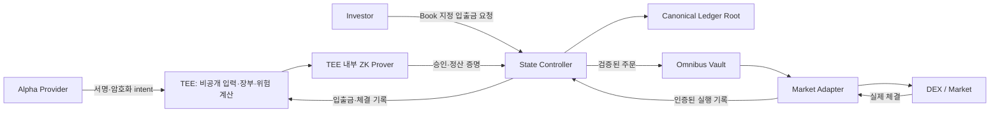

# Confidential Alpha Protocol

**여러 운용자의 비공개 운용 의도를 하나의 Vault에서 실행하되, 자산·거래·손익·지분은 Virtual Book별로 구분하는 프로토콜입니다.** TEE는 비밀 데이터를 처리하고, ZK는 장부 변경이 약정된 규칙과 실제 체결에 맞는지 검증합니다.

> **팀 공용 기준 · 2026-09-20**
>
> 기존 다중 전략 MVP와 TEE·DEX 연결 실험을 아래 팀 설계로 발전시키고 있습니다. **실제 TEE 검증, ZK 전체 장부 검증, 운용자 자기자본·staking, 비상 환매까지 완료된 제품은 아닙니다.** 화면이 열리거나 기존 테스트가 통과했다는 사실만으로 새 명세의 MVP 완료로 판단하지 않습니다.

## 팀원이 먼저 읽을 문서

| 문서 | 확인할 내용 |
|---|---|
| [팀 원본 명세 PDF](docs/specs/confidential-alpha-protocol-v0.1.pdf) | 프로토콜 명세 v0.1, 작성일 2026-09-19. 아키텍처·요구사항 초안과 미확정 항목 |
| [원본 구조도](docs/specs/protocol-architecture.png) | TEE, ZK Prover, State Controller, Vault, Adapter, Virtual Books의 관계 |
| [팀 개발명세·작업 분담](docs/team-development.md) | 데이터·상태 전이·도메인 경계·개발 순서·담당 역할·인수 조건 |
| [구현 및 검증 상태](docs/team-status.md) | 검증된 증거, 개발 중인 부분, 남은 결정, Phala 비용 제한 |
| [용어](CONTEXT.md) | Virtual Book, Omnibus Vault, 자기자본, 성과 staking의 의미 |

명세 v0.1과 이전 Concept v0.2는 서로 다른 문서의 버전입니다. **이번 팀 PDF를 현재 개발 방향으로 삼습니다.** 과거 문서에 남아 있는 alpha 합성, 기여도 기반 배분, PAPER 대시보드는 현재 목표 구조가 아닙니다. 미확정 경제 수치를 구현자가 임의로 확정하지 않습니다.

## 설계가 작동하는 흐름

1. **투자·조건 설정:** 투자자는 Book을 선택합니다. 운용자는 자기 Book에 자기자본을 함께 투자하고 운용 중 지분을 유지합니다. 위험 한도·평가·보수 조건을 미리 정합니다.
2. **비공개 입력:** 운용자는 전략 코드 대신 서명한 목표 포지션·운용 의도를 암호화해 TEE에 보냅니다. 권한·제출 순서·유효 기간을 확인합니다.
3. **주문 승인 증명:** 비공개 장부와 위험 규칙에 따라 주문·예약 자금·체결 배분을 확정합니다. ZK로 기존 장부 R0에서 주문 예약 장부 R1로의 변경을 검증합니다.
4. **실제 체결:** State Controller가 증명을 확인하고 승인한 주문을 Vault·Adapter를 통해 시장에 전달합니다. 동기식 거래에서는 승인·R1 채택·시장 호출·실제 체결 기록이 한 트랜잭션으로 성공하거나 함께 취소됩니다.
5. **체결 정산 증명:** 실제 수량과 비용을 사전 확정한 기준대로 Book에 반영해 R1 → R2를 검증합니다. 손실 체결도 누락 없이 한 번만 반영합니다. 정산 전에는 다음 일반 거래를 승인하지 않습니다.
6. **평가·보수·종료:** 확정 장부로 위험·성과를 계산하고 보수와 stake를 정산합니다. 운용자 원금은 Book 종료와 모든 정산 이후 해제합니다. 투자자 환매에는 실제 유동성과 청구권을 확인합니다.



이 그림은 **목표 구조**입니다. 모든 연결이 현재 검증됐다는 뜻은 아닙니다. 외부 거래 자체는 체인에 공개되며, TEE·ZK가 모든 거래 추론을 제거하지는 않습니다. 서비스 화면은 각 흐름의 입력·상태·결과·검증 증거를 보여주는 인터페이스입니다.

## 현재 구현 상태

| 경로 | 실제로 확인한 것 | 아직 보장하지 않는 것 |
|---|---|---|
| 기존 다중 전략 MVP: src/sleeves, contracts/sleeves | 하나의 Vault, 전략별 장부·투자자 지분·보수, 테스트 토큰과 자체 AMM 실행 | TEE, ZK 장부 검증, 실제 외부 시장과 동일한 운용 조건 |
| 외부 연결 PoC: src/integration, ApprovedVault | Monad 상태를 복제한 로컬 환경에서 Uniswap WMON/USDC 거래, 승인 서명, 체결 복구, 전략 간 분리 | 실제 메인넷 거래, 실제 TEE 하드웨어 검증, 장부 계산의 ZK 검증 |
| 팀 설계 전환 작업 | 두 Book의 ZK 주문 승인·예약·체결 정산 회로 및 연구용 Vault 개발 중 | 통과 확인 전에는 완료로 표시하지 않음. 입출금 지분·staking·전체 위험 규칙·복구는 별도 작업 |

기존 승인 서명은 등록된 키가 승인했다는 의미입니다. **장부 계산의 정확성을 검증하는 ZK 증명과 다릅니다.** 해시·Merkle 포함 증명도 그 자체로 장부 상태 전이의 정확성을 증명하지 않습니다.

저장된 2026-09-19 검증 기록:

- 회귀 테스트 **109개 통과**: [통합 상태](docs/evidence/integration-status.json)
- 외부 DEX 로컬 포크 **16개 검사 통과**: [실행 증거](docs/evidence/external-fork.json), [RPC 재검증](docs/evidence/external-fork-verification.json)
- 기존 자체 AMM 테스트넷 경로: [Omnibus 테스트넷 증거](docs/evidence/omnibus-testnet.json)

각 경로의 기존 범위에 대한 기록이며, 새 팀 명세 전체의 인수 결과가 아닙니다. 최신 진행 상태는 [팀 상태 문서](docs/team-status.md)를 봅니다.

## 운용자 책임과 위험 지표

- **자기자본과 stake는 별도 원금을 두 번 요구하는 구조가 아닙니다.** 자기 Book에 투자한 지분을 유지하고 그 일부에 성과 연동 추가 보상·차감 조건을 부여합니다.
- 일반 운용 손실은 지분 비율대로 반영합니다. **First-loss는 팀 명세의 기본안에서 제외**되어 있습니다.
- 보상률·차감률·수혜자·재원·평가 기간·최소 자기자본·보수율은 미확정입니다. 예시 수치를 확정 정책으로 쓰지 않습니다.
- 우선 검증할 위험 데이터는 노출·집중도, 현금·예약 자금·환매 가능액, 누적 회전율·비용, 고점 대비 하락, 자기자본·활성 stake·최대 차감액, 가격 시각·정산 지연입니다.
- 수익률은 운용 성과입니다. 프로토콜의 회계·권한·체결 검증이 올바르다는 증거로 쓰지 않습니다.

## 로컬 실행과 기존 증거 재현

Node.js 22.13 이상이 필요합니다. 저장소 루트에서 실행합니다.

```bash
rtk npm ci
rtk npm test
rtk npm run build
rtk npm start
```

화면은 http://127.0.0.1:8790 입니다. 현재 화면은 기존 도메인 검토 도구이며 새 ZK·TEE 경로로 아직 이전되지 않았습니다. 기존 사용자 데이터를 자동 초기화하거나 덮어쓰지 않습니다.

```bash
# 실제 외부 DEX 배포 코드를 로컬 Monad 포크에서 실행
rtk npm run prove:external

# 기존 자체 AMM·다중 전략 경로
rtk npm run prove:omnibus
rtk npm run verify:omnibus
```

prove:external은 원격 RPC에서 상태를 읽지만 트랜잭션은 로컬 Anvil로만 보냅니다. 포크 거래 해시는 메인넷 거래 해시가 아닙니다. 새 ZK 재현 명령과 결과는 검증이 끝나면 팀 상태 문서와 함께 갱신합니다.

## TEE 실험과 비용

Phala 가입과 $20 크레딧 확보를 확인했습니다. 2026-09-20 과금 화면에서 **Prepaid / Auto-topup off**로 전환된 것을 확인했습니다. 첫 실험의 사용자 승인 예산은 **최대 $2**입니다.

현재 배포·하드웨어 검증 완료를 주장하지 않습니다. 사양·시간당 요금·종료 후 잔여 과금을 확인한 뒤 짧게 실험합니다. 카드·API 키·운용 키·비공개 입력·witness는 GitHub에 올리지 않습니다. [TEE 운영 안내](docs/external-integration-runbook.md)와 [팀 상태](docs/team-status.md)를 따릅니다.

## 과거 문서

[이전 README](docs/archive/readme-before-team-spec.md), [Concept v0.2](docs/confidential-alpha-v0.2.md), [기존 다중 전략 기록](docs/sleeves-v0.2.md), [Pilot 기록](docs/pilot/development-spec.md)은 당시 구현 자료입니다. 현재 팀 명세·완료 상태와 구분합니다.
