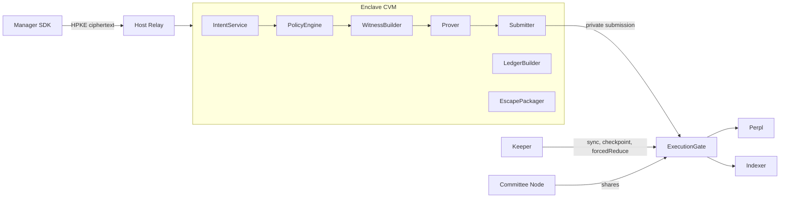
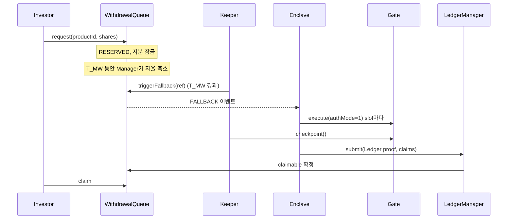
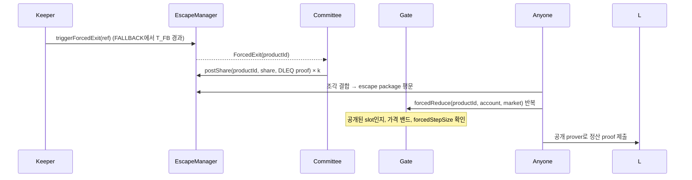

# Monad Metropolis — 개발 상세 명세 v0.1

September 23, 2026 · @재희 · 기준 문서: Doc

제품·프로토콜 명세 v1.4를 구현 가능한 수준으로 내린 개발 문서다. 두 문서가 충돌하면 이 문서의 0절에 적힌 변경이 우선한다.

## 0. 문서 범위와 v1.4 대비 변경

이 문서는 v1 MVP를 구현할 팀이 모듈 경계, 데이터 형식, circuit 제약, 컨트랙트 인터페이스, 테스트 기준을 합의하기 위한 것이다. 수치 중 벤치마크로 확정해야 하는 값은 "초기값"으로 표시한다.

### 0.1 구현 과정에서 v1.4를 바꾼 결정

| 항목 | v1.4 | 이 문서 | 이유 |
| --- | --- | --- | --- |
| 주문 유형 | IOC, LIMIT_GTT | **IOC만** 허용. pool 계정에 미체결 주문 없음 | stale 주문 추출 경로와 openOrderQty 처리 제거. `openOrderQty` signal은 호환용으로 남기고 Gate가 0을 강제 |
| 회계 입력 인증 | Monad 블록 포함 증명 | **Gate 이벤트 누산기** (7절) | 모든 venue 상호작용이 Gate를 거치므로 온체인 누산기로 충분. 청산·ADL은 무허가 `sync`로 포착 |
| 회계 방식 | 체결 이벤트 기반 | **slot 상태 스냅샷 차분** 기반 | 체결·수수료·funding을 따로 파싱하지 않고 증거금과 포지션 상태 변화로 계산 |
| Prover 위치 | 미정 | **Enclave 안** (CVM), prover 바이너리를 attestation에 포함 | witness에 alpha vector 평문이 있음 |
| 제출 경로 | MVP는 public RPC | **Private submission 필수**, relayer도 enclave 안 | 전파~포함 구간의 선행매매 노출 축소 |
| Circuit 구성 | 단일 pre-trade circuit | Trade / Lease / Anchor / Ledger **4개** | 모드별 제약을 분리해 TradeCircuit을 작게 유지 |
| Intent 순서 | sequence = note.sequence + 1 | intent 번호와 note 연산 번호 **분리** | 여러 market을 담은 intent 하나가 여러 proof로 실행됨 |
| Adapter calldata | 호출자가 제공 | **Gate가 package로 생성** | 임의 calldata 경로 제거 |
| Escape 암호화 | verifiable encryption 목표 | BabyJubJub threshold ElGamal + Poseidon 암호화로 **circuit 내 검증** | BN254 circuit에서 네이티브 연산이라 비용이 현실적 |
| 전체 정지 복구 | 미정 | Committee가 **새 attested enclave로 재암호화**해 키 이전 | 평문 노출 없이 복구 |

### 0.2 용어

- **Alpha vector**: TargetIntent의 `targets[]`, market별 최종 절대 목표 수량.
- **Slot**: `(poolAccount, market)`. 동시에 한 Product만 임대한다.
- **Note**: Product 상태의 commitment. 전역 note tree에 저장한다.
- **Op**: note를 소비하는 증명 단위 연산 하나 (거래, lease, anchor 갱신).

## 1. 구성요소와 배포 구조

시스템은 온체인 컨트랙트, enclave 서비스, enclave 밖 보조 서비스, 클라이언트 SDK의 네 묶음이다. 평문 alpha vector와 witness는 enclave 경계를 넘지 않는다.



| 묶음 | 구성요소 | 책임 | 언어 |
| --- | --- | --- | --- |
| 컨트랙트 | ExecutionGate | op 검증, Perpl 호출, 누산기, sync, forcedReduce | Solidity |
| 컨트랙트 | Custody | 담보 보관, 입금 큐, 지급 | Solidity |
| 컨트랙트 | NoteTree, NullifierSet | 전역 note tree, root 이력, nullifier | Solidity |
| 컨트랙트 | LeaseRegistry | slot 상태, leaseEpoch, 무작위 배정 | Solidity |
| 컨트랙트 | ProductRegistry | Product, mandate 해시, keyCommitment, 보수율 | Solidity |
| 컨트랙트 | LedgerManager | Ledger root, checkpoint, NAV 공개 | Solidity |
| 컨트랙트 | WithdrawalQueue | 출금 상태 기계 | Solidity |
| 컨트랙트 | EscapeManager | Freeze·Forced Exit 판정, 복호화 조각 수집 | Solidity |
| 컨트랙트 | ParamRegistry | 거버넌스 파라미터, timelock | Solidity |
| 컨트랙트 | Verifier × 4 | circuit별 Groth16 verifier | Solidity (생성) |
| Enclave | IntentService | 복호화, 서명·epoch 확인 | Rust |
| Enclave | PolicyEngine | Manager policy WASM 실행 | Rust + wasmtime |
| Enclave | StateStore | private book, note opening, 암호화 journal | Rust |
| Enclave | WitnessBuilder, Prover | witness 생성, Groth16 proving | Rust, rapidsnark |
| Enclave | Submitter | 트랜잭션 서명·private 제출 | Rust |
| Enclave | LedgerBuilder, EscapePackager | Ledger batch, escape package | Rust |
| 밖 | Host Relay | ciphertext 전달만. 복호화 불가 | Rust |
| 밖 | Keeper | sync, checkpoint, fallback 트리거, forcedReduce | TypeScript |
| 밖 | Committee Node | DKG, 조각 보관, 조건부 공개·재암호화 | Rust |
| 밖 | Indexer / Dashboard API | 공개 데이터 집계, 지연·양자화 적용 | TypeScript |
| 클라이언트 | Manager SDK | attestation 검증, intent 서명·암호화 | TypeScript, Rust |

배포: enclave는 서로 다른 클라우드의 CVM 최소 2개(active-standby). Committee 노드는 운영자와 다른 주체가 운영한다.

## 2. 기술 스택과 암호 원시

모든 circuit 내부 연산은 BN254 scalar field 위에서 네이티브하게 표현되는 원시로 통일한다. keccak과 secp256k1은 circuit 안에서 쓰지 않는다.

| 용도 | 선택 | 비고 |
| --- | --- | --- |
| Proof 시스템 | Groth16 / BN254 | Monad EVM의 BN254 precompile로 검증. circuit별 trusted setup (Phase 2 ceremony) |
| Circuit 언어 | Circom 2 | circomlib 원시 재사용. 대안: gnark (벤치마크 후 결정) |
| Prover | rapidsnark (CPU) | enclave 안. GPU는 CPU 벤치마크가 목표 미달일 때만 검토 |
| 해시 (circuit, 온체인 공통) | Poseidon, circomlib 파라미터, arity ≤ 16 | 온체인은 검증된 Solidity Poseidon 구현 사용 |
| Manager 서명 | EdDSA-Poseidon on BabyJubJub | circomlib `EdDSAPoseidonVerifier` |
| Intent 암호화 | HPKE (RFC 9180): DHKEM(X25519, HKDF-SHA256), HKDF-SHA256, ChaCha20-Poly1305 | 수신 키 해시를 attestation report data에 포함 |
| Committee 암호화 | BabyJubJub threshold ElGamal (DKG, k-of-n) + Poseidon 기반 대칭 암호화 | circuit 안에서 암호화 정합성 검증 가능 |
| Enclave 플랫폼 | Intel TDX CVM (대안 AMD SEV-SNP) | DCAP quote. 온체인 registry에 승인 MRTD·RTMR 게시 |
| Policy 샌드박스 | wasmtime, WASI 비활성, fuel 제한, 부동소수점 결정성 모드 | policy 모듈 해시를 mandate에 결합 |
| 컨트랙트 | Solidity 0.8.x, Foundry | UUPS proxy + timelock. Escape 경로는 pause 대상에서 제외 |
| 오프체인 서비스 | Rust (enclave), TypeScript (keeper, indexer, SDK 래퍼) |  |

### 2.1 Domain separator

모든 Poseidon 해시는 첫 입력으로 domain 상수를 넣는다. 상수는 `keccak256("monad-metropolis/v1/<NAME>") mod p를 오프라인에서 계산한 상수`로 고정하고, 아래 이름과 `KEY`를 쓴다.

`INTENT`, `INTENT_HDR`, `TARGETS`, `SIG`, `NOTE`, `NOTE_HDR`, `SLOTS`, `ANCHOR`, `NF`, `EXEC`, `SNAP`, `ACC`, `LEDGER_LEAF`, `NAV`, `ESCAPE`, `LEASE_REC`, `SIGNALS`

### 2.2 쓰지 않는 것

MPC, FHE, recursive proof, 온체인 keccak 기반 note 구조. recursive aggregation은 LedgerCircuit 용량이 부족할 때 v2에서 검토한다.

## 3. 데이터 인코딩 규약

모든 값은 circuit에 들어가기 전에 BN254 scalar field 원소(p ≈ 2²⁵⁴) 하나로 변환된다. circuit, 컨트랙트, enclave, SDK는 아래 규칙을 공통 라이브러리 하나로 구현하고, 네 구현이 같은 테스트 벡터를 통과해야 한다.

| 타입 | 원래 값 | Field 인코딩 | Circuit 범위 검사 |
| --- | --- | --- | --- |
| `u64` | 시간, id, epoch, sequence | 그대로 | < 2⁶⁴ |
| `qty` | 부호 있는 lot 수량 | x ≥ 0이면 x, x < 0이면 p − |x| | |x| < 2⁶³ |
| `price` | market 소수 자리 기준 정수 | 그대로 | < 2⁹⁶ |
| `amount` | 담보 토큰 최소 단위 (부호 있음) | `qty`와 동일 | |x| < 2¹²⁸ |
| `bps` | basis point | 그대로 | < 2¹⁶ |
| `address` | 20바이트 | uint160 | < 2¹⁶⁰ |
| `bool` | 0 / 1 | 그대로 | x·(x−1) = 0 |
| `hash` | Poseidon 출력 | 그대로 | 없음 |
| `bytes32` 외부 해시 | keccak 등 | 하위 253비트 | < 2²⁵³ |
| `enum` | side, tif, mode | 정수 코드 (아래) | 허용 집합 소속 |

Enum 코드: `side` BUY = 1, SELL = 2. `tif` IOC = 1. `authMode` MANAGER = 0, FALLBACK = 1. `snapCause` GATE_OP = 1, SYNC = 2, EXTERNAL = 3, CHECKPOINT = 4.

### 3.1 수량과 가격 단위

- 수량은 Perpl market의 lot 단위 정수다. market별 lot 크기와 가격 소수 자리는 ParamRegistry의 `MarketSpec`에 기록하고, 모든 구성요소가 여기서 읽는다.
- 곱셈 결과(수량 × 가격)는 최대 2¹⁵⁹ 미만이다. field 안에서 wraparound가 일어나지 않지만, circuit은 곱셈 전에 양쪽 피연산자의 범위를 반드시 검사한다.
- 나눗셈이 필요한 계산(레버리지 상한, pro-rata 축소, NAV)은 circuit 안에서 나눗셈 대신 곱셈 부등식으로 표현한다. 예: `a / b ≤ c`는 `a ≤ b × c`로 쓴다. 반올림 방향은 항상 프로토콜에 보수적인 쪽이다.

### 3.2 부호 있는 비교

`qty`끼리의 크기 비교는 양쪽에 2⁶³을 더해 음이 아닌 수로 만든 뒤 64비트 비교기를 쓴다. `|x|`가 필요하면 부호 비트를 witness로 받아 제약으로 검증한다.

## 4. 핵심 데이터 구조와 해시

아래 정의가 circuit, 컨트랙트, enclave의 단일 기준이다. `P(...)`는 Poseidon이고, 첫 인자는 2.1절의 domain 상수다. 고정 용량은 `MAX_TARGETS = 7`, `MAX_SLOTS = 16`, `MAX_MARKETS = 16`, `NOTE_DEPTH = 32`다.

### 4.1 TargetIntent

```
intentHdr   = P(INTENT_HDR, chainId, productId, mandateVersion, managerKeyEpoch,
                intentSeq, maxSlippageBps, tif, expiresAt, targetCount)
targetsHash = P(TARGETS, m0, t0, m1, t1, ..., m6, t6)      // 빈 자리는 (0, 0)
intentComm  = P(INTENT, intentHdr, targetsHash, salt)
sigMsg      = P(SIG, intentComm, managerKeyEpoch)          // 서명은 암호문 안에 넣음
signature   = EdDSA-Poseidon(managerSk, sigMsg)
keyCommitment = P(KEY, pk.x, pk.y, keySalt)                  // ProductRegistry에 게시
```

- `intentSeq`는 Product별로 엄격히 증가한다. 건너뛰기는 허용한다 (delta 0인 intent는 온체인 op가 없음).
- 한 intent에 market이 여러 개면 market마다 TradeCircuit op가 하나씩 생기고, note의 `intentMask`로 처리 여부를 추적한다.
- `MAX_TARGETS = 7`은 Poseidon arity 16 제한에서 나온다. 8개 이상은 intent를 나눠 제출한다.

### 4.2 Product State Note

```
noteHdr  = P(NOTE_HDR, productId, opSeq, intentSeq, intentMask, keyCommitment,
             mandateVersion, exitOnly, availableCapital, slotCount,
             fallbackRef, fallbackDoneMask)
slotLeaf = P(account, market, leaseEpoch, qty, lastOpAcc)      // lastOpAcc: 이 slot의 마지막 op 시점 누산기 길이
slotsHash = P(SLOTS, P(slotLeaf0..7), P(slotLeaf8..15))     // 빈 slot은 0
anchorHash = P(ANCHOR, ledgerRoot, cutoffTime, verifiedEquity)
noteSecret_n = P(productSecret, n)                            // n = opSeq
noteComm  = P(NOTE, noteHdr, slotsHash, anchorHash, noteSecret_opSeq)
nullifier = P(NF, noteSecret_opSeq, productId, opSeq)
```

- `productSecret`은 Product 생성 시 enclave가 만든다. note 복구에는 이 값 하나만 있으면 된다.
- `fallbackRef`와 `fallbackDoneMask`는 진행 중인 fallback 출금과, 이미 축소를 마친 slot을 기록한다 (11절).
- slot의 free balance는 note가 아니라 Gate storage의 공개 `slotCredit`으로 관리한다 (7절). slot은 Product와 연결되지 않으므로 공개해도 무방하다.

### 4.3 ExecutionPackage

```
executionHash = P(EXEC, account, market, leaseEpoch, signedQty, limitPrice, tif,
                  orderExpiresAt, marginDelta, reduceOnly, authMode, withdrawalRef)
```

Gate는 package 필드로 이 해시를 직접 계산하고, Perpl 호출 calldata도 package에서 생성한다. 호출자가 calldata를 넘기는 경로는 없다.

### 4.4 Slot Snapshot과 누산기 (7절)

```
snap   = P(SNAP, account, market, leaseEpoch, size, entryPrice, positionMargin,
           fundingIndex, slotCredit, markPrice, blockNumber, cause, custodyFlow)
acc_i  = P(ACC, acc_{i-1}, snap_i)
```

### 4.5 Ledger Leaf

```
ledgerLeaf = P(LEDGER_LEAF, productId, totalShares, unitNav, equity, feeLiability,
               seriesRoot, withdrawalRoot, slotStateHash, lastAccIndex)
```

Ledger tree는 depth 16 (Product 최대 65,536개)의 Poseidon Merkle tree다. `seriesRoot`는 투자자 시리즈별 지분·HWM의 Merkle root, `withdrawalRoot`는 처리 중인 출금 목록의 root다.

## 5. TradeCircuit

slot 하나에 대한 주문 op 하나를 증명한다. Manager 서명 주문(`authMode = 0`)과 fallback 출금 축소(`authMode = 1`)를 같은 circuit에서 처리한다. 예상 규모는 4만~5만 제약이며 (Merkle 경로 약 8k, EdDSA 약 7k, note 해시 전후 약 20k, 레버리지·선택 로직 약 5k), 벤치마크로 확정한다.

### 5.1 Public signals (36개, 순서 고정)

출처: **C** = 호출자 제공, **G** = Gate가 계산하거나 온체인에서 읽음, **S** = ParamRegistry.

| # | Signal | 출처 | Gate의 추가 검사 |
| --- | --- | --- | --- |
| 0 | treeRoot | C | 최근 K개 root 안 |
| 1 | nullifier | C | 미사용, 검증 후 기록 |
| 2 | newNoteComm | C | 검증 후 tree에 추가 |
| 3 | executionHash | G | package로 계산 |
| 4–6 | account, market, leaseEpoch | G | slot ACTIVE, epoch 일치 |
| 7 | position | G | Perpl에서 읽음 |
| 8 | openOrderQty | G | Perpl에서 읽음. 0이 아니면 revert |
| 9 | slotCredit | G | Gate storage |
| 10–25 | markPrice[0..15] | C | Perpl mark와 `markTolBps` 이내. 미사용 market은 0 |
| 26 | blockTimeBound | C | ≥ block.timestamp |
| 27 | reduceOnly | C (package) | 1이면 |position| 감소 확인 |
| 28 | marginDelta | C (package) | — |
| 29–30 | lMaxBps, haircutBps | S | — |
| 31 | ledgerRoot | C | Ledger root 이력 안. `reduceOnly = 0`이면 그 root의 cutoff 나이 ≤ `maxAnchorAge` |
| 32 | authMode | C (package) | 1이면 withdrawalRef가 FALLBACK 상태 |
| 33 | withdrawalRef | C (package) | authMode 0이면 0 |
| 34 | fallbackBps | G | WithdrawalQueue에서 withdrawalRef로 읽음 |

이전 초안에서 바뀐 점: anchor 나이 검사를 Gate로 옮겨 `maxAnchorAgeSec` signal을 없앴다. Gate가 ledgerRoot의 cutoff 시각을 직접 알기 때문에, note 안의 cutoff 시각을 믿을 필요가 없다. `slotCredit`, `authMode`, `withdrawalRef`, `fallbackBps`를 추가했다. 표 마지막에 35번 `accIndex`(출처 G, 현재 누산기 길이)가 붙는다. AnchorCircuit이 어느 slot 수량을 Ledger 값으로 교체할지 판단하는 데 쓴다.

### 5.2 Private witness

이전 note 전체와 `productSecret`, note Merkle path, 대상 slot 인덱스 `k`, 그리고 authMode 0일 때 intent 전체·서명·Manager 공개키·`keySalt`·target 인덱스 `j`, `limitPrice`·`tif`·`orderExpiresAt`.

### 5.3 제약

| ID | 제약 |
| --- | --- |
| T1 | noteComm이 treeRoot 아래 존재. nullifier가 4.2 정의와 일치 |
| T2 | slot[k] = (account, market, leaseEpoch), k < slotCount |
| T3 (mode 0) | sigMsg에 대한 EdDSA 서명 유효. keyCommitment 일치. intent의 productId·mandateVersion·keyEpoch가 note와 일치 |
| T4 (mode 0) | intentSeq > note.intentSeq 이거나, 같으면서 intentMask의 j번째 비트가 0 |
| T5 (mode 0) | targets[j].market = market. signedQty = targets[j].qty − position − openOrderQty |
| T6 (mode 0) | expiresAt ≥ blockTimeBound, orderExpiresAt ≤ expiresAt |
| T7 (mode 0) | BUY면 limitPrice ≤ mark[market] × (10⁴ + maxSlippageBps) / 10⁴, SELL이면 ≥ mark × (10⁴ − maxSlippageBps) / 10⁴ (곱셈 부등식으로) |
| T8 (mode 1) | reduceOnly = 1. withdrawalRef ≠ 0. note.fallbackRef ∈ {0, withdrawalRef}. fallbackDoneMask의 k번째 비트가 0. 축소 후 |position + signedQty| × 10⁴ ≤ |position| × (10⁴ − fallbackBps), 부호 반전 없음. 지정가는 Gate의 bandBps 검사만 받는다. withdrawalRef가 공개되므로 fallback op에서는 이 slot의 소유 Product가 드러난다. Manager 비협조 상황의 의도된 trade-off다 |
| T9 | reduceOnly = 1이면 |position + signedQty| ≤ |position|이고 부호 반전 없음. note.exitOnly = 1이면 reduceOnly = 1 |
| T10 | marginDelta > 0이면 custodyDraw = max(0, marginDelta − slotCredit) ≤ availableCapital |
| T11 (reduceOnly = 0) | Σ_{i≠k} |qty_i| × mark[m_i] + |position + signedQty| × mark[market] ≤ lMaxBps × (10⁴ − haircutBps) × verifiedEquity / 10⁸ |
| T12 | note.anchor.ledgerRoot = ledgerRoot |
| T13 | executionHash가 4.3 정의와 일치 |
| T14 | 새 note: opSeq + 1. slot[k].qty = position + signedQty (Gate가 읽은 최신 값 기준). slot[k].lastOpAcc = accIndex. availableCapital −= custodyDraw. mode 0이면 intentSeq·intentMask 갱신, mode 1이면 fallbackRef 설정·done 비트 기록 |
| T15 | 3절의 모든 범위 검사 |

T11에서 대상 slot은 Gate가 읽은 최신 position을 쓰고, 나머지 slot은 note의 수량을 쓴다. note의 수량은 청산 이후 실제보다 클 수 있으므로 보수적인 값이다.

## 6. LeaseCircuit, AnchorCircuit, LedgerCircuit

### 6.1 LeaseCircuit

slot을 note에 추가(ACTIVATE)하거나 비우고 반납(RELEASE)한다. 자금 이동은 RELEASE의 `slotCredit` 회수뿐이다.

| # | Public signal | 출처 |
| --- | --- | --- |
| 0–2 | treeRoot, nullifier, newNoteComm | C |
| 3 | op (1 = ACTIVATE, 2 = RELEASE) | C |
| 4–6 | account, market, leaseEpoch | G (LeaseRegistry의 예약 또는 ACTIVE slot) |
| 7 | position | G. RELEASE면 0이어야 함 |
| 8 | slotCredit | G. RELEASE 시 Custody로 회수할 금액 |
| 9 | committeePkX, committeePkY (9–10번) | S (EscapeManager의 현재 threshold 공개키) |
| 11 | leaseRecCtHash | G (calldata로 받은 암호문의 해시) |
| 12 | accIndex | G |

제약:

- **ACTIVATE**: slotCount < 16, 같은 market의 slot이 없음. 새 slot의 `lastOpAcc = accIndex`, `qty = 0`. 암호문이 committee 공개키로 `(productSecret, slot, opSeq)`를 암호화한 것임을 ElGamal + Poseidon 암호화 제약으로 증명.
- **RELEASE**: 대상 slot의 position = 0. slot을 목록에서 제거. availableCapital += slotCredit.

### 6.2 AnchorCircuit

note의 anchor를 최신 Ledger root로 갱신한다. 다른 연산 없이 단독 op로 실행한다.

| # | Public signal | 출처 |
| --- | --- | --- |
| 0–2 | treeRoot, nullifier, newNoteComm | C |
| 3 | ledgerRoot | C (Ledger root 이력 안) |
| 4 | cutoffTime | G (LedgerManager) |

제약: ledgerLeaf(productId)가 ledgerRoot 아래 존재한다. anchor = (ledgerRoot, cutoffTime, leaf.equity)로 교체한다. 각 slot에 대해 `lastOpAcc ≤ leaf.lastAccIndex`이면 수량을 leaf의 slot 상태 값으로 교체하고, 아니면 유지한다. leaf의 출금 목록에 note.fallbackRef가 정산 완료로 기록되어 있으면 fallbackRef와 fallbackDoneMask를 초기화한다.

### 6.3 LedgerCircuit

두 checkpoint 사이의 누산기 구간, 입금 큐 구간, 출금 큐 구간을 반영해 Ledger root를 전이하고, 모든 Product의 NAV를 확정한다.

| # | Public signal | 출처 |
| --- | --- | --- |
| 0–1 | oldLedgerRoot, newLedgerRoot | C / G (현재 root) |
| 2–5 | accFrom, accTo, accHashFrom, accHashTo | G (Gate 누산기) |
| 6–7 | depositHashFrom, depositHashTo | G (Custody 입금 큐) |
| 8–9 | withdrawalHashFrom, withdrawalHashTo | G (WithdrawalQueue) |
| 10 | cutoffTime | G (checkpoint 시각) |
| 11 | navHash | C (게시된 Product별 AUM·unitNav 배열의 해시) |
| 12 | claimHash | C (게시된 출금 확정 목록의 해시) |
| 13 | escapeHash | C (게시된 escape package 암호문들의 해시) |
| 14–15 | committeePkX, committeePkY | S |

용량 (초기값): 스냅샷 `E_MAX = 1024`, 입금 `D_MAX = 64`, 출금 `W_MAX = 64`, Product `P_MAX = 64`. 수백만 제약 규모로 예상되며 proving은 분 단위다. 구간이 용량을 넘으면 중간 root를 거쳐 여러 proof로 나눈다.

처리 순서:

1. **Slot 귀속**: Ledger 상태 안에 비공개 `leaseMap`(slot, epoch → productId)을 둔다. 누산기의 lease 기록을 witness로 열어 갱신한다.
2. **스냅샷 반영**: 스냅샷마다 해당 Product의 slot 상태를 교체한다. 같은 slot의 연속 스냅샷 사이 증거금·slotCredit 변화와 `custodyFlow`로 현금 흐름을 계산한다.
3. **평가**: checkpoint 스냅샷의 mark로 slot equity = positionMargin + size × (mark − entryPrice) − 미지급 funding + slotCredit을 계산한다. Product equity = Custody 내 자본 + Σ slot equity.
4. **성과보수**: 발생 부채를 갱신하고, `feePeriod` 경계면 시리즈별 HWM으로 확정한다.
5. **입금**: 이번 cutoff의 unitNav로 지분을 발행한다.
6. **출금**: exit 조건을 충족한 출금을 확정 목록에 넣고 지분을 소각한다. fallback op(스냅샷에 withdrawalRef가 있는 체결)의 mark 대비 체결 비용은 해당 출금 투자자에게 배분한다.
7. **Escape package**: Product마다 `(productSecret, slot 목록, book 요약)`을 committee 키로 암호화했음을 증명한다.
8. **보존식**: Custody 잔액 + Σ slot equity ≥ Σ Product 청구권.

## 7. Venue 상태 동기화와 이벤트 누산기

pool 계정은 Gate만 조작할 수 있으므로, Gate가 slot 상태가 바뀔 때마다 스냅샷을 온체인 해시 체인(누산기)에 쌓으면 그 체인이 LedgerCircuit의 인증된 입력이 된다. 블록 포함 증명은 쓰지 않는다. Gate 밖에서 일어나는 변화(청산, ADL, funding)는 무허가 `sync`가 포착한다.

### 7.1 스냅샷을 쌓는 시점

| 시점 | cause | 비고 |
| --- | --- | --- |
| Gate op 직전, 현재 상태가 마지막 스냅샷과 다를 때 | EXTERNAL (3) | 청산·ADL·funding 정산을 op 전에 기록 |
| Gate op 직후 | GATE_OP (1) | `custodyFlow`에 이번 op의 Custody ↔ slot 이동액 기록 |
| `sync(slot)` 호출 | 변화 있으면 EXTERNAL (3), 없으면 SYNC (2) | 누구나 호출 가능. Keeper는 변동성이 클 때 자주 호출 |
| `checkpoint()` | CHECKPOINT (4) | FREE가 아닌 모든 slot을 한 트랜잭션에서 스냅샷. checkpoint 기록 저장 |

Lease op은 스냅샷 대신 lease 기록 항목을 쌓는다: `P(LEASE_REC, account, market, leaseEpoch, op, leaseRecCtHash)`.

### 7.2 Perpl에서 읽는 값

스냅샷 필드는 4.4절과 같다. Gate의 Perpl Adapter는 다음 읽기 함수가 필요하다: 포지션 size·entryPrice·positionMargin, 누적 funding 지표, mark price, margin mode, 계정 free balance, 미체결 주문 수. 이 함수들이 Perpl 컨트랙트에서 제공되는지 확인해야 한다 (15절).

### 7.3 slotCredit

한 계정의 free balance는 여러 slot이 공유하지만, 한 Gate op은 한 market만 건드린다. 그래서 op 전후 계정 free balance의 변화는 전부 그 slot의 몫이다. Gate는 이 차이를 해당 slot의 `slotCredit`에 더하거나 뺀다.

- 증거금 추가(`marginDelta > 0`): slotCredit을 먼저 쓰고, 부족분만 Custody에서 가져온다 (`custodyDraw`).
- 증거금 해제·손익 실현: 계정 free balance로 들어오고, slotCredit이 증가한다. Custody로는 돌려보내지 않는다. Perpl 출금 속도 제한 때문이다.
- Custody 회수: LeaseCircuit RELEASE에서만 일어난다. Perpl 출금이 한도에 걸리면 RELEASE가 revert되고, slot은 DRAINING에 머문다.
- 불변조건: 모든 op 후 `Σ slotCredit(계정의 slot들) = 계정 free balance`. 어긋나면 revert한다.

### 7.4 Checkpoint

- Keeper가 `T_LEDGER` 간격으로 호출한다. 이전 checkpoint 이후 `T_LEDGER`가 지나지 않았으면 revert한다.
- 저장 값: `checkpointId`, 누산기 길이와 해시, 입금·출금 큐 해시, 블록 시각.
- 한 트랜잭션의 slot 루프 가스를 제한하기 위해 pool 전체 slot 수를 `N_POOL_MAX = 256`으로 제한한다.
- 청산이 checkpoint 직전에 일어나도 checkpoint 스냅샷이 현재 상태를 읽으므로 평가가 누락되지 않는다.

## 8. 스마트 컨트랙트 인터페이스

모든 상태 변경 함수는 Product를 식별하는 값을 인자나 이벤트로 받거나 내보내지 않는다. 예외는 Product가 원래 공개되는 함수(등록, 입금, 출금 요청)와 fallback·escape 경로뿐이다.

### 8.1 ExecutionGate

```solidity
struct Groth16Proof { uint256[2] a; uint256[2][2] b; uint256[2] c; }

struct ExecutionPackage {
    address account; uint32 market; uint64 leaseEpoch;
    int128  signedQty; uint128 limitPrice; uint8 tif; uint64 orderExpiresAt;
    int256  marginDelta; bool reduceOnly; uint8 authMode; uint256 withdrawalRef;
}

struct TradeCallerSignals {
    uint256 treeRoot; uint256 nullifier; uint256 newNoteComm;
    uint256[16] markPrice; uint64 blockTimeBound; uint256 ledgerRoot;
}

function execute(uint16 circuitVersion, Groth16Proof calldata proof,
                 TradeCallerSignals calldata sig, ExecutionPackage calldata pkg) external;

function leaseOp(uint16 circuitVersion, Groth16Proof calldata proof, LeaseCallerSignals calldata sig,
                 LeaseTarget calldata target, bytes calldata leaseRecCiphertext) external;

function anchorOp(uint16 circuitVersion, Groth16Proof calldata proof, AnchorCallerSignals calldata sig) external;

function sync(address account, uint32 market) external;           // 무허가
function checkpoint() external;                                     // 무허가, 간격 제한
function cancelStale(address account, uint32 market) external;      // 무허가, 미체결 주문 취소
function forcedReduce(uint256 productId, address account, uint32 market) external; // Escape 모드만
```

### 8.2 `execute` 처리 순서

1. Freeze 중이면 `pkg.reduceOnly = true`만 허용한다.
2. slot이 ACTIVE이고 `leaseEpoch`가 일치하는지 확인한다. Perpl에서 margin mode, position, openOrderQty, 계정 free balance, mark를 읽는다.
3. 상태가 마지막 스냅샷과 다르면 EXTERNAL 스냅샷을 추가한다.
4. 36개 signal을 조립한다 (5.1). `executionHash`는 pkg로 계산하고, G·S 값은 직접 채운다.
5. 검사: treeRoot 이력, nullifier 미사용, markPrice 오차, blockTimeBound, 가격 밴드, 주문 notional 상한, openOrderQty = 0, isolated 모드, ledgerRoot 이력과 anchor 나이 (reduceOnly가 아닐 때), authMode = 1이면 출금 상태가 FALLBACK.
6. `verifier[circuitVersion].verifyProof(a, b, c, signals)`.
7. nullifier 기록, newNoteComm을 tree에 추가.
8. `custodyDraw`만큼 Custody에서 계정으로 입금하고, slotCredit에서 차감한 뒤, Perpl에 증거금 조정과 IOC 주문을 실행한다.
9. free balance 차이를 slotCredit에 반영하고, 불변조건을 검사하고, GATE_OP 스냅샷을 추가한다.

하나라도 실패하면 전체가 revert된다. 이벤트 `Executed(nullifier, newNoteComm, account, market, leaseEpoch, signedQty, limitPrice, accIndex)`를 내보낸다.

### 8.3 나머지 컨트랙트

| 컨트랙트 | 주요 함수 | 저장 상태 |
| --- | --- | --- |
| Custody | `deposit(productId, amount)`, `claim(claimId)` | 담보 잔액, 입금 큐 해시 체인 |
| NoteTree | `insert(comm)` (Gate만), `isKnownRoot(root)` | incremental Poseidon tree (depth 32), root 이력 K개 |
| NullifierSet | `spend(nf)` (Gate만) | mapping |
| LeaseRegistry | `reserve(market)`, `activate`, `beginDrain`, `release` (Gate만) | slot 상태, epoch, 예약 만료 |
| ProductRegistry | `register(mandateHash, policyHash, keyCommitment, feeBps)`, `proposeMandate`, `rotateKey` | Product 메타데이터, mandate 버전 |
| LedgerManager | `submit(proof, sig, navData, claims, escapeCts)` | Ledger root 이력, cutoff 시각, 공개 NAV |
| WithdrawalQueue | `request(productId, shares)`, `triggerFallback(ref)` | 요청 상태, 출금 큐 해시 체인 |
| EscapeManager | `triggerForcedExit(ref)`, `postShare(productId, share, proof)`, `recoverKeyTo(attestedPk)` | Freeze·Escape 상태, committee 공개키, 조각 |
| ParamRegistry | `set(key, value)` (timelock) | 파라미터, MarketSpec, 승인 enclave measurement |

### 8.4 업그레이드와 pause

모든 컨트랙트는 UUPS proxy이고, 업그레이드는 `T_UPGRADE` timelock을 거친다. pause는 `execute`, `leaseOp`의 ACTIVATE, 입금만 멈춘다. `sync`, `checkpoint`, `forcedReduce`, 출금 요청·청구, `triggerForcedExit`는 pause 대상이 아니다. 운영자가 pause로 출구를 막을 수 없게 하기 위해서다. 업그레이드 timelock 중에는 투자자가 출금을 요청할 수 있어야 하므로 `T_UPGRADE > T_MW + T_FB`로 둔다.

## 9. Enclave 서비스

enclave는 하나의 CVM 이미지로 빌드하며, 모든 모듈이 한 프로세스 안에서 동작한다. 이미지는 재현 가능 빌드(reproducible build)로 만들고, 그 measurement를 ParamRegistry에 등록한다. 평문 로그는 enclave 밖으로 나가지 않는다.

### 9.1 모듈

| 모듈 | 입력 | 출력 | 목표 지연 (p50) |
| --- | --- | --- | --- |
| IntentService | HPKE ciphertext | 검증된 intent (서명, epoch, intentSeq, 만료) | 10 ms |
| PolicyEngine | intent, private book, 시장 데이터 | allow / deny + 사유 | 50 ms |
| WitnessBuilder | intent, note opening, Gate 읽기값 | circuit witness, 예상 public signal | 20 ms |
| Prover | witness | Groth16 proof | 300 ms |
| Submitter | proof, package | 서명된 트랜잭션, private 제출 | 제출 10 ms |
| StateStore | op 결과, Gate 이벤트 | note opening, private book, journal | 비동기 |
| LedgerBuilder | 누산기 구간, 큐, private book | LedgerCircuit witness, NAV·claim·escape 데이터 | 분 단위 |

WitnessBuilder는 Gate가 채울 signal(position, slotCredit, accIndex 등)을 Monad RPC로 미리 읽는다. 제출 전에 값이 바뀌면 Gate에서 검증이 실패하므로, Submitter는 실패 시 최신 값으로 witness를 다시 만들어 최대 `RETRY_MAX`번 재시도한다.

### 9.2 키 계층

| 키 | 생성 | 용도 |
| --- | --- | --- |
| Root key | 첫 enclave 부팅 시 생성 | 아래 키 파생, 백업 대상 |
| Intent 수신 키 (X25519, epoch별) | root에서 HKDF | HPKE 복호화. 공개키 해시를 attestation report data에 넣음 |
| Journal 키 | root에서 HKDF | journal 레코드 AES-256-GCM |
| productSecret | Product 생성 시 난수 | note secret, nullifier 파생 |
| Submitter 키 (secp256k1) | root에서 파생, `RELAYER_POOL` 개 | 가스 지불 주소. 순환 사용 |

### 9.3 복제와 복구

- **정상 운영**: active 1개, standby 1개 이상. 서로 RA-TLS로 attestation을 확인한 뒤 root key를 공유한다. standby는 journal을 따라가며 상태를 유지한다.
- **Journal**: 모든 상태 변경을 암호화 레코드로 append하고, 레코드마다 이전 해시를 포함하는 해시 체인으로 묶는다. 외부 object storage 두 곳에 복제한다. Ledger 제출 때 journal head 해시를 LedgerManager에 기록한다.
- **전체 인스턴스 손실**: root key는 committee threshold 키로 암호화한 백업이 온체인에 있다. 새 enclave는 `EscapeManager.recoverKeyTo(attestedPk)`로 복구를 요청한다. committee 구성원은 새 enclave의 attestation quote를 검증한 뒤, 부분 복호화 조각을 그 enclave의 공개키로 암호화해 전달한다. 구성원 누구도 root key 평문을 보지 못한다.

### 9.4 PolicyEngine 샌드박스

Manager policy는 WASM 모듈 하나이며, `evaluate(ctx) -> {allow, reasonCode}` 함수를 export한다. `ctx`는 현재 book, 주문 후 예상 포지션, 시장 데이터(출처 표시 포함)를 담는다. fuel 한도와 50ms 타임아웃을 넘기면 deny다. 모듈 해시는 mandate에 결합되어 있어, 등록된 모듈과 다르면 실행을 거부한다.

### 9.5 Side channel 대응

- 공용 호스트를 쓰지 않는다. 전용 bare-metal 또는 단독 테넌트 인스턴스에서 실행한다.
- rapidsnark의 MSM은 scalar에 따라 메모리 접근이 달라진다. v1은 이 위험을 문서화하고 잔여 위험으로 둔다. 대응책은 v2에서 constant-time MSM을 벤치마크해 결정한다.
- 로그와 메트릭은 모듈 경계에서 수치 버킷화를 거친 값만 밖으로 내보낸다.

## 10. Manager SDK와 제출 경로

SDK는 attestation 검증, intent 구성·서명·암호화, 영수증과 결과 확인을 맡는다. host는 암호문과 암호화된 응답만 중계한다.

### 10.1 SDK API (TypeScript)

```tsx
verifyEnclave(quote: Uint8Array, registry: Address): Promise<EnclaveInfo>   // measurement, epoch, 수신 공개키
buildIntent(p: { productId; targets: {market; qty}[]; maxSlippageBps; ttlSec }): Intent
sealIntent(intent: Intent, managerSk: EdDSAKey, enclave: EnclaveInfo): Envelope
submit(env: Envelope): Promise<Receipt>                                      // enclave 서명 영수증
status(receiptId: string): Promise<IntentStatus>                              // Manager 전송 키로 복호화
rotateKey(newPk, keySalt): Promise<TxRequest>                                // managerKeyEpoch 증가
```

- `intentSeq`는 SDK가 로컬에서 증가시키고, 영수증으로 enclave와 동기화한다.
- 서명은 암호문 안에 넣는다. 서명 메시지는 `P(SIG, intentComm, managerKeyEpoch)`다. 재전송 공격은 intentSeq와 만료로 막으므로, 암호문 해시에 서명할 필요가 없다.

### 10.2 Envelope

| 필드 | 내용 |
| --- | --- |
| `v` | 1 |
| `keyEpoch` | enclave 수신 키 epoch |
| `enc` | HPKE encapsulated key |
| `ct` | CBOR `{intent, signature, managerTransportPk}`의 HPKE 암호문 |

응답(영수증, 상태)은 `managerTransportPk`로 HPKE 암호화해서 돌려보낸다. host는 응답 내용도 볼 수 없다.

### 10.3 결과 코드

`EXECUTED`, `PARTIAL` (IOC 일부 체결), `NOT_FILLED`, `POLICY_DENY`, `EXPIRED`, `STALE_STATE` (재시도 초과), `BAND_EXCEEDED`, `INSUFFICIENT_CAPITAL`, `LEVERAGE_CAP`, `EXIT_ONLY`, `FROZEN`, `LEASE_UNAVAILABLE`, `SUBMISSION_PUBLIC_FALLBACK` (아래 참조).

### 10.4 제출 경로

- Submitter는 enclave 안의 relayer 키로 트랜잭션을 서명하고, Monad validator의 private 제출 엔드포인트로 보낸다. 가용 여부는 15절의 확인 항목이다.
- private 엔드포인트를 쓸 수 없을 때의 동작은 Product mandate의 `submissionPolicy`가 정한다. `PRIVATE_ONLY`면 대기하다가 만료되고, `ALLOW_PUBLIC`이면 `PRIVATE_WAIT_MS` 후 public RPC로 보내고 결과에 `SUBMISSION_PUBLIC_FALLBACK`을 표시한다. 기본값은 `PRIVATE_ONLY`다.
- relayer 키마다 nonce를 따로 관리하고, 한 키에서 같은 Product의 op가 연달아 나가지 않게 순환한다. 같은 주소가 반복되면 slot 간 연결 단서가 되기 때문이다.

## 11. 출금·Fallback·Escape 시퀀스

출금은 세 단계로 격상된다: Manager 창 → TEE가 증명하는 fallback → TEE 없이 진행하는 Forced Exit. 단계가 올라갈 때마다 프라이버시를 더 포기하고 확실성을 얻는다.

### 11.1 정상 출금과 Fallback



- `fallbackBps` = 잠긴 지분 / 총 지분. 각 slot을 이 비율 이상 줄인다.
- 같은 Product에 fallback이 겹치면 두 번째 요청은 첫 번째가 정산될 때까지 대기한다. note의 `fallbackRef`는 하나만 담기 때문이다.
- LedgerCircuit은 Product의 모든 slot이 필요한 비율만큼 줄었는지 스냅샷으로 확인한 뒤 claim을 확정한다. Manager 창에서 Manager가 충분히 줄였다면 fallback 없이 확정될 수 있다.

### 11.2 Forced Exit



- 조각에는 DLEQ proof를 붙여, 잘못된 조각을 온체인에서 거절한다.
- 복원된 package의 해시가 마지막 Ledger root에 결합된 `escapeHash` 항목과 일치해야 `forcedReduce`가 slot 목록을 받아들인다. 마지막 cutoff 이후 ACTIVATE된 slot은 lease 기록 암호문도 함께 복호화한다.
- Forced Exit가 발동된 Product는 영구히 EXIT_ONLY다. `productSecret`이 공개되므로 note를 더 이상 비공개로 운영할 수 없다.

### 11.3 Global Freeze

Ledger root가 `T_FREEZE` 동안 갱신되지 않으면 누구나 `EscapeManager.freeze()`를 호출할 수 있다. Freeze 중에는 Gate가 `reduceOnly` 주문만 받는다. `T_ESCAPE`가 더 지나면 모든 Product에 Forced Exit를 발동할 수 있다. Ledger root가 갱신되면 Freeze는 자동 해제된다.

## 12. 파라미터 초기값

아래 값은 테스트넷 시작점이다. circuit 용량 상수는 컴파일 시 고정되고, 나머지는 ParamRegistry에서 timelock을 거쳐 바꾼다.

### 12.1 Circuit 상수 (변경 시 새 circuitVersion)

| 상수 | 값 | 근거 |
| --- | --- | --- |
| `MAX_MARKETS` | 16 | mark vector 길이 |
| `MAX_SLOTS` | 16 | Product당 동시 slot |
| `MAX_TARGETS` | 7 | Poseidon arity |
| `NOTE_DEPTH` | 32 | note 약 43억 개 |
| `LEDGER_DEPTH` | 16 | Product 65,536개 |
| `E_MAX`, `D_MAX`, `W_MAX`, `P_MAX` | 1024, 64, 64, 64 | Ledger batch 용량 |

### 12.2 거버넌스 파라미터

| 파라미터 | 초기값 | 조정 기준 |
| --- | --- | --- |
| `bandBps` | BTC 50, ETH 75, 기타 150 | market 유동성 |
| `markTolBps` | 15 | proving 중 가격 변동 p99 |
| `maxOrderNotional` | market별, 호가 깊이의 5% | 시장 충격 |
| `lMaxBps`, `haircutBps` | 50000 (5배), 1000 | Perpl 최대 레버리지, cutoff 간 손실 분포 |
| `ROOT_HISTORY_K` | 64 | 동시 op 수 × 재시도 |
| `maxAnchorAge` | 3600초 | `T_LEDGER`의 6배 |
| `T_LEDGER` | 600초 | LedgerCircuit proving 시간 |
| `T_MW`, `T_FB` | 24시간, 24시간 | 운용 유연성과 투자자 보호 |
| `T_FREEZE`, `T_ESCAPE` | 6시간, 72시간 | 정상 장애 복구 시간보다 충분히 길게 |
| `forcedStepSize` | slot 수량의 10% 또는 `maxOrderNotional` 중 작은 값 | 시장 깊이 |
| `T_UPGRADE` | 72시간 | `T_MW + T_FB`보다 김 |
| `N_POOL_MAX` | 256 | checkpoint 가스 |
| `minPoolPerMarket`, `minActiveProducts` | 8, 5 | 추론 공격 결과 |
| `D_PROV`, `q_ret` | 1시간, 0.5%p | 추론 공격 결과 |
| `feePeriod`, `noticePeriod` | 분기, 14일 | 상품 정책 |
| `RELAYER_POOL` | 16 | 주소 순환 |
| `RETRY_MAX`, `PRIVATE_WAIT_MS` | 3, 2000 | 제출 성공률 |
| Committee k-of-n | 5-of-9 | 독립성과 가용성 |

## 13. 테스트와 검증 계획

가장 위험한 버그는 circuit이 틀린 명제를 받아들이는 것(soundness)과, 네 구현(circuit, 컨트랙트, enclave, SDK)의 인코딩이 어긋나는 것이다. 테스트는 이 두 가지를 먼저 겨냥한다.

### 13.1 참조 모델

Rust로 프로토콜 전체의 참조 모델을 먼저 만든다. note 전이, delta, 레버리지, Ledger 회계, NAV, 성과보수, 출금 정산을 순수 함수로 구현한다. circuit, 컨트랙트, enclave 결과는 모두 이 모델과 차분 비교한다.

### 13.2 테스트 종류

| 종류 | 대상 | 합격 기준 |
| --- | --- | --- |
| 인코딩 테스트 벡터 | 3·4절의 모든 해시와 변환 | 4개 구현이 같은 출력 |
| Circuit 완전성 | 정상 witness | 모든 경우에 proof 생성·검증 성공 |
| Circuit 건전성 | 제약 ID마다 하나 이상의 위반 witness (T1~T15, Lease, Anchor, Ledger) | 전부 witness 생성 또는 검증 실패 |
| 제약 누락 감사 | under-constrained signal 탐지 도구 (circomspect 등) + 수동 리뷰 | 경고 0 또는 문서화된 예외 |
| 컨트랙트 단위·퍼즈 | Foundry. 모든 revert 경로, signal 조립 | 분기 커버리지 95% 이상 |
| 불변조건 퍼즈 | 무작위 op 시퀀스 (거래, 청산, sync, 입출금, freeze) | 아래 13.3 불변조건 위반 0 |
| Perpl 포크 테스트 | Monad 테스트넷 Perpl에 실제 주문·청산 유발 | 스냅샷과 참조 모델 회계 일치 |
| Enclave 통합 | 실제 TDX, attestation, 복제, journal 재생 | 강제 종료 후 상태 복구 |
| 장애 리허설 | enclave 전체 정지 → Forced Exit 전 과정 | 운영팀 개입 없이 정산 완료 |
| 추론 공격 red team | 테스트넷 공개 데이터만으로 slot 귀속 추정 | 정확도가 `minActiveProducts` 조건에서 목표치 미만 |
| 성능 벤치마크 | TradeCircuit p50·p99, Ledger batch, 제출 지연 | 26절(v1.4) 예산 충족 |

### 13.3 불변조건

- Custody 잔액 + Σ slot equity ≥ Σ Product 청구권
- 모든 계정에서 Σ slotCredit = 계정 free balance
- 한 slot은 동시에 한 Product에만 귀속
- nullifier는 한 번만 사용
- 서명 없는 op(authMode 0)는 존재하지 않음
- 체결가는 항상 mark ± bandBps 이내
- Freeze 중 |position|이 증가한 slot 없음
- pause 상태에서도 출금 요청·claim·forcedReduce 가능

### 13.4 외부 감사

circuit, 컨트랙트, enclave 코드를 각각 다른 감사 팀에 맡긴다. 메인넷 전에 trusted setup ceremony를 공개 참여로 진행한다.

## 14. 마일스톤

순서는 위험이 큰 가정을 먼저 검증하도록 정했다. 기간은 팀 규모가 정해진 뒤 채운다. 각 단계는 종료 기준을 충족해야 다음 단계로 넘어간다.

| 단계 | 산출물 | 종료 기준 |
| --- | --- | --- |
| M0 외부 의존성 확인 | Perpl 컨트랙트 조사 보고서, Monad private 제출 조사 | 15절의 차단 항목(B1~B4) 해소 또는 대안 확정 |
| M1 참조 모델과 인코딩 | Rust 참조 모델, 인코딩 라이브러리 4종, 테스트 벡터 | 4개 구현 테스트 벡터 일치 |
| M2 TradeCircuit 벤치마크 | TradeCircuit, rapidsnark 실행, TDX 안 측정 | enclave 안 p50 ≤ 300ms. 미달이면 설계 재검토 |
| M3 온체인 코어 | Gate, NoteTree, Lease, Custody, Verifier, Adapter, 누산기 | 테스트넷 Perpl에서 증명된 주문 체결, 불변조건 퍼즈 통과 |
| M4 Enclave 파이프라인 | IntentService부터 Submitter까지, SDK, 복제, journal | Manager SDK → 체결 end-to-end p50 < 1초 |
| M5 회계와 출금 | Lease·Anchor·LedgerCircuit, LedgerManager, WithdrawalQueue, 성과보수 | 포크 테스트에서 참조 모델과 NAV 일치, 출금 정산 성공 |
| M6 Escape | EscapeManager, committee 노드, DKG, forcedReduce, 공개 prover | enclave 전체 정지 리허설에서 정산 완료 |
| M7 공개 테스트넷 | Indexer, 대시보드, red team | 추론 공격 결과로 `D_PROV`, `q_ret`, anonymity 하한 확정 |
| M8 감사와 메인넷 | 감사 3건, trusted setup ceremony, 법률 검토 | 치명·높음 등급 이슈 0 |

M2를 앞에 둔 이유는 1초 목표가 전체 설계의 전제이기 때문이다. enclave 안 proving이 목표에 크게 못 미치면 circuit 구조(예: signal 해시 묶기, 서명 검증 위치)를 바꿔야 하고, 그 변경은 M3 이후에 하면 비용이 크다.

## 15. 외부 의존성과 미결 사항

### 15.1 차단 항목 (M0에서 해소)

| ID | 확인할 것 | 해소되지 않을 때 |
| --- | --- | --- |
| B1 | Perpl: 컨트랙트 소유 계정 허용, 포지션 margin mode 읽기와 isolated 강제, 7.2절 읽기 함수, 증거금 추가·해제 API, IOC 주문 | 설계 전제가 무너짐. venue 재선정 또는 account 단위 Lease로 전환 |
| B2 | Perpl 전역 출금 속도 제한이 RELEASE와 claim 지급에 주는 실제 지연 | Custody 유동성 버퍼 비율 상향, 출금 지급 SLA 없음으로 공시 |
| B3 | Monad validator private 제출 경로 존재 여부 | 기본값을 `ALLOW_PUBLIC`로 바꾸고 선행매매 노출을 공시 |
| B4 | Monad의 BN254 precompile 가스, 블록 가스 한도, `PREVRANDAO` 지원 | Lease 무작위 배정을 commit-reveal로 대체 |

### 15.2 미결 사항

| ID | 내용 | 현재 결정 |
| --- | --- | --- |
| O1 | NoteTree insert 가스. depth 32 incremental tree는 insert마다 온체인 Poseidon 32회가 필요하다. 거래 한 건에 수십만~백만 gas 규모가 될 수 있다 | M3에서 측정. 과하면 depth 24로 축소하거나, 대기 큐 + 배치 insert proof 구조를 검토 |
| O2 | Verifier 가스. 36개 signal은 signal마다 타원곡선 곱셈이 추가된다 | M3에서 측정. 과하면 signal 해시 묶기(`SIGNALS` domain) |
| O3 | Manager 창 출금의 exit 비용 배분. v1.4 20.2절은 출금 투자자에게 배분하라고 했지만, Manager의 자율 축소와 출금용 축소를 구분할 수 없다 | v1은 Manager 창 비용은 Product 전체가 부담하고, fallback op 비용만 출금 투자자에게 배분. 제품 명세에 반영 필요 |
| O4 | fallback op의 attribution 노출 (5.3 T8) | 의도된 trade-off로 공시 |
| O5 | MSM side channel (9.5) | 잔여 위험으로 공시, v2에서 constant-time MSM 검토 |
| O6 | intent당 market 7개 제한 | SDK가 자동 분할 |
| O7 | LedgerCircuit 용량 초과 시 확장 | 순차 sub-batch. Product 수가 `P_MAX`를 넘으면 recursive aggregation 검토 |
| O8 | 규제 검토 결과에 따른 view key, 사용자 접근 제한 | 법률 검토 후 반영 |

### 15.3 제품 명세 v1.4에 역반영할 항목

0.1절의 변경 전부, O3의 비용 배분 규칙, O4의 fallback 노출, private submission 필수화, prover의 enclave 내 실행.