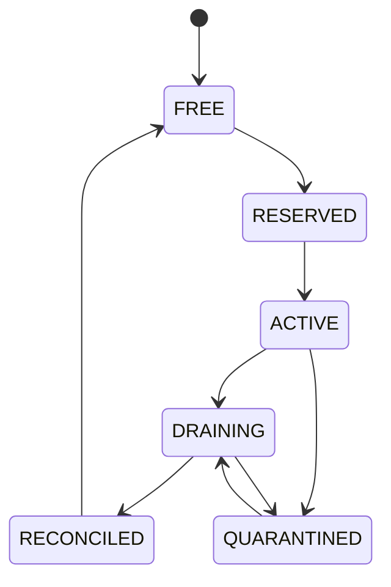
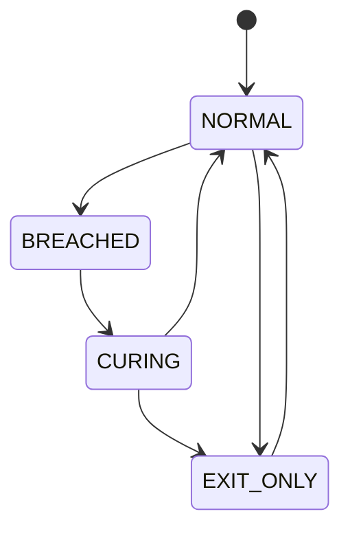
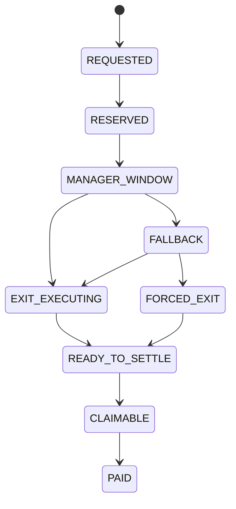
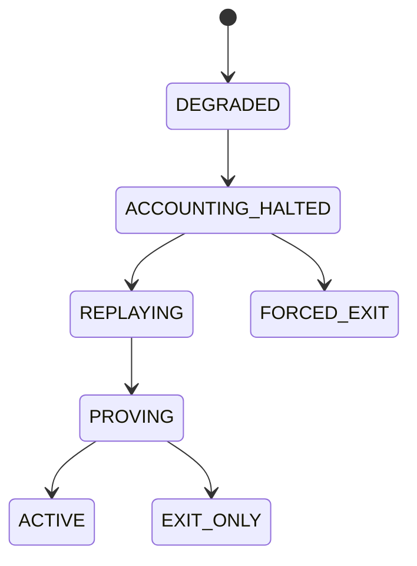
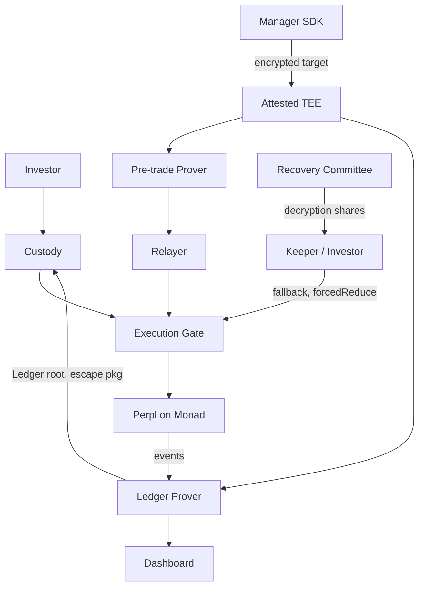

2026년 9월 23일 · @재희

**Project:** Monad Metropolis · **Protocol:** Confidential Trade Intent Execution · **Venue:** Perpl on Monad

## v1.3 → v1.4 변경 요약

v1.4는 v1.3의 신뢰 계층 구조를 유지하되, 격리·가격·liveness·프라이버시 주장 네 곳의 공백을 막는다. 보장하지 않는 것은 v1.3보다 더 명시적으로 적는다.

|  |  |  |  |
| --- | --- | --- | --- |
| 영역 | v1.3 | v1.4 | 이유 |
| Lease 단위 | `(account, market)` 공유 허용 | `(account, market) 유지. 단 포지션별 isolated margin 확인, slot별 free balance 귀속 증명, cross 모드 도입 시 account 단위로 강제 전환` | Perpl은 현재 isolated 전용이지만 cross·hybrid 모드가 예고되어 있고, 계정 free balance는 공유된다 |
| 체결 가격 | Manager가 priceBounds 설정 | Gate가 oracle mark 대비 가격 밴드를 강제 (Protocol invariant) | 자기 계정과의 체결로 Product 자금을 빼내는 경로 차단 |
| Liveness | Fallback Exit이 TEE·prover에 의존 | Forced Exit(escape hatch) 추가, attribution 키 threshold 에스크로 | TEE 정지 시 출금 불능 방지 |
| 상태 root | 전역 `currentRoot` | 전역 append-only commitment tree + root 이력 창 + Product state note nullifier | 동시 거래 간 proof 무효화 방지. Product별 root는 갱신 자체가 attribution을 노출한다 |
| Delta 계산 | `target - position` | `target - position - openOrderQty`, position은 Gate가 실행 시점에 온체인에서 확인 | 증명 중 체결로 인한 과잉 주문 방지 |
| 청산·ADL | 미정의 | 해당 market target 자동 무효화 | 청산 직후 재진입 방지 |
| Privacy 주장 | Target Vector·Portfolio 비공개 | 실행 전 기밀성 + attribution 약화로 정정 | 전용 slot 포지션은 곧 target이다 |
| Dashboard | 초 단위 provisional 공개 | 지연·양자화 공개, anonymity set 최소치 | 수익률 시계열이 attribution을 복원한다 |
| TEE 위협 | policy 손상만 명시 | 선행매매·선택적 검열 명시, 운영자 분리 요구 | 경제적 최대 피해가 ZK 범위 밖 |
| 서명 스킴 | 미정 | SNARK 친화 서명 필수 | 1초 목표와 in-circuit 검증 양립 |
| Signed state | 서명 주체 미정 | Safety Core 입력에서 제외 | 정의되지 않은 신뢰 가정 제거 |
| 성과보수 | 수시 crystallize 가능 | 정기 + 출금 시점에만 crystallize | Ledger proof 부하 감소 |
| 규제 | 없음 | 출시 전 검토 항목으로 추가 | 위탁 운용 구조의 법적 성격 |

## 1. 목적과 보장 범위

투자자는 Manager의 운용 활동에 자본을 배분하고, Manager의 target은 실행 전까지 enclave 밖에 노출되지 않으며, 자금의 소유권·운용 권한·실행 무결성·회계 정확성은 암호학적으로 검증된다. 투자자는 특정 모델이 아니라 Manager의 운용 활동 자체에 투자한다.

프로토콜이 보장하는 것:

- Product 자본은 해당 Product의 주문·손실·수수료에만 쓰인다.
- Manager 서명 없이는 어떤 target도 실행되지 않으며, 서명된 target과 다른 주문은 실행되지 않는다.
- 체결 가격은 프로토콜 가격 밴드를 벗어날 수 없다.
- 회계 상태 전이와 출금액은 Ledger proof로 검증된다.
- TEE·prover·Manager가 모두 멈춰도 투자자는 Forced Exit으로 자금을 회수할 수 있다. 이 경우 해당 Product의 프라이버시는 포기된다.

프로토콜이 보장하지 않는 것:

- 전략의 품질, 수익성, target이 특정 알고리즘에서 생성되었다는 사실.
- 실행 이후의 target 비밀성. 체결된 포지션은 공개 체인에 남는다.
- Manager와 실행 계정 간 연결의 완전한 은닉. attribution은 약화될 뿐이다.
- TEE 침해 시 target 기밀성과 Manager policy 집행.
- 검열 저항성. 지연·거부는 liveness 장치로 완화할 뿐 제거하지 않는다.
- venue(Perpl) 자체의 지급불능, ADL, 담보 토큰 실패로부터의 보호.

## 2. 신뢰 계층

신뢰는 네 계층으로 나뉘며, 각 계층이 실패했을 때 무엇을 잃는지가 설계의 기준이다.

|  |  |  |  |
| --- | --- | --- | --- |
| 계층 | 역할 | 실패 시 잃는 것 | 실패해도 유지되는 것 |
| Smart Contract | 자금 보관, proof 검증, nullifier, Lease 상태, 가격 밴드, 출금 청구권, Forced Exit | 전부 (버그 시) | 없음. 감사·pause·migration으로 대응 |
| Minimal ZK Safety Core | 권한, intent 결합, delta, 자본 귀속, 격리, 실행 결합 증명 | circuit 버그 시 잘못된 증명 수용 | Contract가 직접 검사하는 불변조건 |
| Attested TEE | 복호화, Manager policy 계산, private book 유지, proof witness 생성 | target 기밀성, Manager policy 집행, 가용성 | 자금 경계, 실행 결합, 가격 밴드, Forced Exit 경로 |
| Recovery Committee | attribution 키 threshold 보관 | k개 이상 담합 시 attribution 노출 | 자금 이동 권한은 없음 |

TEE는 unrestricted custody authority를 가지지 않는다. Recovery Committee는 자금 이동 권한이 없고, Forced Exit 조건이 온체인에서 성립했을 때만 키 조각을 공개한다.

원칙: Contract가 직접 읽고 검사할 수 있는 조건은 ZK로 옮기지 않는다. ZK는 비공개 입력이 필요한 조건에만 쓴다.

## 3. 참여자

|  |  |  |
| --- | --- | --- |
| 참여자 | 권한 | 비고 |
| Investor | Product 선택, 입금, 무승인 출금 요청, Forced Exit 발동 | 플랫폼 score가 allocation을 자동 변경하지 않는다 |
| Manager | Product 생성, mandate·성과보수 설정, TargetIntent 서명·제출 | 전략 코드가 아니라 Private Target Vector를 제출한다 |
| TEE Operator | enclave 호스팅, proof 생성, 제출 | 트레이딩 이해관계 분리 서약 필요 (25절) |
| Keeper | 출금 fallback 트리거, Forced Exit 실행 | 무허가. 보상은 해당 Product에서 고정 수수료 |
| Recovery Committee | attribution 키 조각 보관 (k-of-n) | 운영자와 독립된 주체로 구성 |

v1은 1 Manager = 1 Product다. Product마다 지분, 자본, 손익, mandate, 성과보수, private accounting이 독립적으로 관리된다.

## 4. Target Intent 의미론

Manager는 market별 최종 절대 포지션 수량을 제출하고, 프로토콜은 그 차이만큼만 주문한다. 서명 이후 프로토콜은 target을 변경하지 않는다.

```
TargetIntent {
    chainId, product, mandateVersion, managerKeyEpoch
    sequence, baseStateVersion
    targets[] { market, targetQuantity }
    maxSlippageBps          // 밴드 내에서 Manager가 더 좁게 지정
    fillPolicy              // IOC | LIMIT_GTT
    expiresAt
    replacePolicy           // REPLACE_ALL_OPEN | KEEP_OPEN
    salt
}
```

### 4.1 Delta 계산

```latex
\text{delta} = \text{targetQuantity} - \text{position} - \text{openOrderQty}
```

`position`과 `openOrderQty`는 Gate가 실행 시점에 venue에서 직접 읽은 값과 일치해야 한다 (12절). `replacePolicy = REPLACE_ALL_OPEN`이면 기존 미체결 주문을 먼저 취소하고 `openOrderQty = 0`으로 계산한다.

### 4.2 수명 규칙

- 명시되지 않은 market에는 주문하지 않는다. 현재 포지션이 그대로 유지된다.
- `targetQuantity = 0`은 해당 market의 flat을 뜻한다.
- target은 일회성 지시다. delta 주문이 체결되거나 만료되면 그 target은 소진된다. 프로토콜은 이후 가격 변화나 포지션 변화에 맞춰 target을 재추종하지 않는다.
- `expiresAt` 이후 미체결분은 취소되고, 이전 target으로 되돌아가지 않는다. 결과 포지션이 곧 현재 상태다.
- 청산·ADL이 발생한 market의 target은 즉시 무효화된다 (15절). 재진입은 새 서명이 필요하다.
- `sequence`는 Product별로 엄격히 증가한다. `baseStateVersion`이 현재 Product State Note의 sequence와 다르면 거절한다.

## 5. Target 기밀성과 서명

목표는 "승인된 attested enclave 외부에는 실행 전 plaintext target을 노출하지 않는다"이다. 아무 계산 주체도 target을 볼 수 없다는 보장이 아니며, 실행 후 체결 결과의 비밀성도 보장하지 않는다.

### 5.1 Attestation

Manager SDK는 암호화 전에 다음을 검증한다: 승인된 enclave measurement, attestation certificate chain, freshness challenge, enclave public key, code version, 현재 key epoch. 승인 measurement 목록은 온체인 registry에 게시한다.

### 5.2 Commitment와 서명

```
commitment       = Poseidon(domain, TargetIntent, salt)
managerSignature = Sign_sk(commitment, ciphertextHash, sequence, domain)
```

- 서명 스킴은 SNARK 친화적이어야 한다 (예: BabyJubJub 위 EdDSA). secp256k1 ECDSA의 in-circuit 검증은 1초 목표와 양립하기 어렵다.
- Manager 공개키는 온체인에 평문으로 두지 않고, Product 등록 시 keyCommitment로만 게시한다. 온체인 서명 검증은 Manager 신원을 노출하므로 서명 검증은 circuit 안에서만 한다.
- 키 교체는 `managerKeyEpoch` 증가로 처리하고, 이전 epoch의 서명은 거절한다.

### 5.3 전송

ciphertext는 operator host를 경유하지만 host는 복호화할 수 없다. host가 ciphertext를 지연·폐기할 수 있으므로, SDK는 제출 영수증(enclave 서명)을 받지 못하면 재전송하고, 반복 실패는 25절의 검열 이벤트로 기록한다.

## 6. Manager Risk Mandate

Manager가 정의한 risk policy는 TEE Policy Engine이 집행하며 ZK로 증명하지 않는다. 투자자는 이 집행이 TEE 무결성에 의존한다는 사실을 UI에서 명시적으로 고지받는다.

예: max leverage 3x, BTC 비중 30% 이하, portfolio VaR 5% 이하, margin buffer 15% 이상, max drawdown 20%, custom stress rule.

지원 계산: VaR/CVaR, historical volatility, correlation, concentration, drawdown, funding exposure, scenario analysis, stress testing, backtesting, custom indicator와 expression.

실행 규칙:

- risk expression은 deterministic sandbox에서 실행한다. 외부 네트워크 접근과 arbitrary code 실행은 금지한다.
- expression의 입력 데이터 출처(온체인 / REST·WS)를 policy마다 기록한다. 14절의 분류에 따라 provisional 입력에 의존하는 policy는 UI에 표시한다.
- mandate 원문과 expression 해시는 온체인에 게시한다. 투자자는 무엇이 약속되었는지 검증할 수 있고, 집행 여부는 TEE를 신뢰해야 한다.
- Manager policy는 Protocol Safety Invariants(7절)를 완화할 수 없다. 더 엄격하게만 할 수 있다.

### 6.1 Mandate Versioning

mandate와 성과보수율은 소급 변경할 수 없으며, PROPOSED → NOTICE → ACTIVE → RETIRED 순서로만 바뀐다. NOTICE 기간(`noticePeriod`)에는 변경 내용, 적용 시점, 출금 방법을 투자자에게 공개하고, 이 기간의 출금 요청은 이전 version 조건으로 정산한다. 이전 version에서 서명한 intent는 새 version에서 쓸 수 없다. note의 mandateVersion이 바뀌기 때문이다.

## 7. Protocol Safety Invariants

Manager가 끌 수 없고 TEE 침해로도 우회할 수 없는 절대 규칙이다. v1.4는 체결 가격 제약을 이 목록에 추가한다.

|  |  |  |
| --- | --- | --- |
| Invariant | 강제 주체 | 내용 |
| Manager authorization | ZK | 유효 epoch의 Manager 서명, commitment 일치 |
| Intent → execution binding | ZK + Contract | executionHash가 서명된 target에서 유도됨 |
| Delta correctness | ZK + Contract | delta = target − position − openOrderQty, position·openOrderQty는 실행 시점 온체인 값 |
| Capital ownership | ZK | 사용 증거금이 해당 Product root에 귀속 |
| No cross-product funding | ZK + Contract | Lease 계정의 증거금 원천이 단일 Product |
| Lease validity | Contract | 계정이 ACTIVE 상태이고 leaseEpoch 일치 |
| Replay protection | Contract | Product별 nullifier 미사용, sequence 증가 |
| Price band | Contract | 지정가가 venue mark price ± bandBps 이내 |
| Order size ceiling | Contract | 단일 주문 notional ≤ market별 상한 |
| Resting order staleness | Contract | GTT 주문 수명 ≤ maxRestSec, 밴드 이탈 시 누구나 취소 가능 |
| Protocol leverage ceiling | ZK | 주문 후 총 notional ≤ L_max × 최근 검증 equity |

### 7.1 가격 밴드가 막는 것

Manager는 넓은 가격으로 주문을 내고 자기 개인 계정으로 받아 Product 자금을 빼낼 수 있다. attribution이 숨겨져 있어 외부 감시로 잡기 어렵다. 따라서:

- `bandBps`는 market별로 거버넌스가 정하며 Manager가 완화할 수 없다. Manager의 `maxSlippageBps`는 그 안에서 더 좁게만 설정할 수 있다.
- 오래 걸린 지정가 주문이 시세 변동 후 자기 계정과 체결되는 경로를 막기 위해, GTT 주문은 `maxRestSec`로 수명을 제한하고 밴드를 벗어난 미체결 주문은 무허가로 취소할 수 있다.
- 밴드는 거래당 추출 가능한 가치를 bandBps × notional로 제한할 뿐 0으로 만들지 않는다. 반복 추출 탐지는 Ledger 단계의 체결 품질 통계(평균 mark 대비 체결 괴리)를 Product별로 공개해 보완한다.

## 8. Execution Account Pool과 Lease

실행 단위는 `(poolAccount, market)` slot이다. 이 구조는 Perpl이 포지션별 isolated margin을 제공한다는 전제 위에서만 Product 격리를 만족한다. Perpl 문서는 현재 isolated margin 전용이라고 밝히고 있지만, cross·hybrid 모드를 개념으로 제시하고 있다 (Perpl Margin).

### 8.1 격리 전제 조건 (모두 Contract가 강제)

- **Isolated 확인**: Adapter는 매 호출 전에 대상 포지션의 margin mode가 isolated인지 확인한다. 아니면 revert한다.
- **Free balance 귀속**: 계정 수준 free collateral은 isolated 모드에서 청산에 쓰이지 않으므로 venue 위험은 섞이지 않는다. 다만 회계상으로는 섞일 수 있으므로, slot별 free balance 귀속을 Product State Note에 기록하고 증거금 투입 proof가 자기 귀속분만 쓰는지 증명한다. 매 거래마다 Custody로 회수하지 않는다. Perpl 출금은 전역 속도 제한 대상이기 때문이다 (20절).
- **Cross 모드 도입 시**: Perpl이 cross 또는 hybrid를 기본값으로 바꾸거나 isolated 강제가 불가능해지면, 거버넌스는 pool을 account 단위 Lease(1 account = 1 Product)로 전환한다. 전환 전까지 신규 Lease 발급을 중단한다.
- **실행 계정 소유권**: 모든 pool 계정의 owner는 Gate contract다. EOA 키로 직접 거래하거나 출금하는 경로는 없다.

### 8.2 Slot lifecycle



slot이 FREE로 돌아갈 때 `leaseEpoch`를 증가시킨다. 이전 epoch의 proof, 주문, replay는 거절된다. RECONCILED는 포지션 0, 미체결 주문 0, 증거금 회수 완료를 온체인에서 확인한 상태다.

### 8.3 배정과 anonymity set

- Lease 배정은 TEE가 고르지 않는다. FREE slot 중 온체인 난수로 선택한다. TEE가 특정 계정을 반복 배정하는 방식으로 attribution을 흘리는 경로를 막기 위해서다.
- market별 FREE+ACTIVE slot 수가 `minPoolPerMarket` 미만이면 해당 market의 신규 Lease를 중단한다.
- Lease는 v1에서 강제 교체하지 않는다. 장기 Lease는 같은 계정의 포지션 이력으로 연결되며, 이는 23절의 프라이버시 한계에 포함된다.

### 8.4 증거금 회수 제약

Perpl은 포지션 증거금 감소(DCP)에 120초 만료 조건과 초기증거금 충족 조건을 두고, 미결제약정이 한도의 85%(기본값)를 넘으면 DCP를 막는다 (Perpl Margin). 따라서 출금·Forced Exit 경로는 DCP가 아니라 포지션 축소·청산으로 증거금을 회수한다. 축소 주문은 초기증거금 조건에서 면제된다.

## 9. Custody와 Product 격리

Custody는 물리적으로 하나의 contract지만, Product별 경제적 청구권은 공개 잔액이 아니라 Product State Note(10절) 안의 값으로 관리한다. 공개되는 것은 검증 cutoff 시점의 Product AUM뿐이다 (24절).

공개 잔액으로 두지 않는 이유: Product별 온체인 잔액이 증거금 투입 시점마다 줄어들면, 그 시점과 pool 계정 입금을 대조해 attribution이 바로 복원된다.

### 9.1 격리 불변조건

|  |  |
| --- | --- |
| 불변조건 | 강제 방식 |
| A의 주문은 A 자본만 사용 | 증거금 투입 proof가 A note의 잔액 차감을 증명 |
| A의 손실은 A에 귀속 | Ledger proof의 fill attribution |
| A의 출금은 B 자산 사용 금지 | 출금 claim은 Ledger root상 A의 검증된 equity 이내 |
| A의 청산은 B 자산으로 보전 금지 | isolated margin + slot 단위 Lease (8절) |
| A의 수수료는 A에서만 발생 | Ledger proof의 fee attribution |
| Custody 총액 ≥ 모든 Product 청구권 합 | 매 Ledger proof의 보존식 (16절) |

### 9.2 프로토콜이 제거하지 못하는 공통 위험

Perpl ADL, insurance fund 소진, venue 지급불능, 담보 토큰 실패, Perpl 전역 출금 속도 제한은 프로토콜이 제거할 수 없다. 발생 시 실제 영향을 받은 slot의 Product에 기록한다. 원인이 특정 Product의 포지션이라도 venue 메커니즘으로 다른 Product가 손실을 입으면, 그 손실은 교차 보조로 보고 사건 기록에 따로 표시한다.

## 10. 온체인 상태 구조

Product 상태는 전역 append-only commitment tree의 note로 저장한다. Product별 root를 온체인에 두면 root가 갱신되는 순간 어느 Product가 거래했는지 드러나므로 쓰지 않는다.

### 10.1 Product State Note

```
note = Poseidon(
    productId, sequence, keyCommitment, mandateVersion,
    availableCapital, slotSet, freeBalanceAttribution,
    ledgerAnchor, noteSecret
)
nullifier = Poseidon(noteSecret, productId, sequence)
```

- 거래 proof는 이전 note의 nullifier를 공개하고 새 note commitment를 tree에 추가한다. nullifier에서 productId를 역산할 수 없다.
- 같은 Product의 두 거래는 같은 note를 소비하려 하므로 하나만 성공한다. 이것이 Product 내 순서 보장이다.
- 다른 Product의 거래는 서로 다른 note를 소비하므로 병렬로 처리된다.

### 10.2 Root 이력 창

Gate는 최근 `K`개 tree root 중 하나를 기준으로 한 proof를 받는다. 다른 Product의 거래로 root가 바뀌어도 진행 중인 proof가 무효화되지 않는다. 이중 사용은 nullifier가 막는다.

### 10.3 공개 레지스트리

|  |  |  |
| --- | --- | --- |
| 레지스트리 | 내용 | Product 연결 여부 |
| Product Registry | productId, mandate 해시, keyCommitment, 성과보수율, 검증 cutoff AUM | 공개 |
| Lease Registry | slot 상태, leaseEpoch | Product와 연결하지 않음 |
| Nullifier Set | 사용된 nullifier | 연결하지 않음 |
| Ledger Root | 전 Product를 묶은 회계 root | 연결하지 않음 |

Ledger proof는 모든 Product를 한 batch로 묶는다. Product별로 따로 증명하면 어느 Product에 활동이 있었는지 드러나기 때문이다.

## 11. Pre-trade ZK Safety Core

Pre-trade proof는 "이 주문은 서명된 target에서 유도되었고, 이 Product의 자본만 쓰며, 프로토콜 한도 안에 있다"는 것만 증명한다. Manager policy는 증명하지 않는다.

### 11.1 입력

|  |  |
| --- | --- |
| 구분 | 항목 |
| Public | treeRoot, nullifier, newNoteCommitment, executionHash, account, market, leaseEpoch, position, openOrderQty, markPriceVector, blockTimeBound, circuitVersion |
| Private | TargetIntent, managerSignature, Manager 공개키, 이전 note 전체, noteSecret, Merkle path, productId, slot별 수량 |

`position`, `openOrderQty`, `markPriceVector`는 Gate가 실행 시점 온체인 값과 대조한다 (12절). `markPriceVector`는 모든 market의 mark를 담으므로 Product가 어떤 market을 보유하는지 드러내지 않는다.

### 11.2 증명 명제

1. 이전 note가 treeRoot의 tree에 포함되고 nullifier가 올바르게 유도된다.
2. note의 keyCommitment가 Manager 공개키와 일치하고, 서명이 intent commitment에 대해 유효하다.
3. intent의 product, mandateVersion, keyEpoch가 note와 일치하고, sequence가 note.sequence + 1이며, 만료되지 않았다.
4. `(account, market, leaseEpoch)`가 note.slotSet에 있다.
5. delta = target − position − openOrderQty이고, executionHash가 이 delta와 지정가로부터 유도된다.
6. 투입 증거금 ≤ note.availableCapital + 해당 slot의 free balance 귀속분이다.
7. 주문 후 Σ |qty_i| × mark_i ≤ L_max × (1 − h) × 최근 검증 equity이다.
8. 새 note가 차감된 자본, 갱신된 slot별 수량, sequence + 1로 올바르게 구성된다.

### 11.3 포트폴리오 한도를 비공개로 계산하는 방법

명제 7은 Product의 모든 slot 포지션이 필요하다. 이를 public input으로 넣으면 slot 집합이 연결되어 버린다. 그래서 note가 slot별 수량을 저장하고, 매 거래 proof가 delta만큼 갱신한다.

수량은 자기 거래, 청산, ADL로만 바뀐다. 청산과 ADL은 수량을 줄이기만 하므로 note의 값은 보수적인 상한이 된다. 가격은 public mark vector로 반영한다. equity는 마지막 검증 cutoff 값에 haircut `h`를 적용한다. cutoff 이후 손실이 반영되지 않는다는 한계를 `h`로 흡수하며, `h`는 ledger proof 주기와 market 변동성으로 정한다.

## 12. Execution Gate

Gate는 자금이 venue로 움직이는 유일한 경로이며, 모든 검사와 Adapter 호출을 하나의 atomic 트랜잭션에서 처리한다. Perpl은 주문 매칭과 정산을 모두 온체인에서 수행하므로 (Perpl Architecture), Gate는 venue 상태를 증명 없이 직접 읽는다.

### 12.1 검사 순서

1. proof 검증, circuitVersion이 활성 상태.
2. treeRoot가 최근 `K`개 root 안에 있음.
3. nullifier 미사용.
4. slot이 ACTIVE이고 leaseEpoch 일치.
5. 실행 package의 해시가 executionHash와 일치.
6. public input의 position, openOrderQty가 해당 slot의 현재 온체인 값과 일치.
7. markPriceVector가 현재 Perpl mark와 `markTolBps` 이내.
8. 지정가가 mark ± `bandBps` 이내 (7절).
9. 주문 notional ≤ market별 상한.
10. 대상 포지션이 isolated margin 모드 (8절).
11. blockTime ≤ blockTimeBound.

통과하면 Adapter를 호출하고, nullifier를 기록하고, 새 note commitment를 tree에 추가한다. 하나라도 실패하면 전체가 revert한다.

### 12.2 Gate가 하지 않는 것

- Product를 식별하는 이벤트를 내보내지 않는다. 이벤트는 nullifier, note commitment, slot, 주문 내용만 담는다.
- 운영자, TEE, Manager, Keeper 누구에게도 proof 없이 Adapter를 호출하는 권한을 주지 않는다. 예외는 무허가 함수 두 개뿐이다: 밴드를 벗어난 미체결 주문 취소(`cancelStale`), 그리고 Forced Exit 모드에서의 축소 주문(21절).

### 12.3 Perpl 수수료·최소 주문

delta가 Perpl 최소 주문 단위보다 작으면 주문하지 않고 target을 소진 처리한다. 반올림 규칙은 lot 단위 내림이며, 잔여분은 결과 포지션으로 남는다.

## 13. Submission Layer

proof와 실행 package는 추상화된 Protected Execution Submission Layer로 전달하며, MVP는 public RPC를 기본으로 한다. private relay, 직접 validator 제출, encrypted mempool은 선택적 구현이다.

MVP에서 mempool에 올라간 트랜잭션은 포함 전에 관찰될 수 있다. 관찰자가 알 수 있는 것은 slot, 방향, 수량, 지정가이며, 이는 어차피 체결 직후 공개된다. 노출 창은 제출부터 블록 포함까지이고, 이 사이의 선행매매 손실은 가격 밴드와 `maxSlippageBps`가 상한을 정한다.

제출자는 가스를 대납하는 relayer다. relayer 주소는 Product와 무관하게 순환 사용하며, 가스 비용은 Ledger에서 해당 Product에 배분한다. Manager나 Product 소유 주소로 직접 제출하는 것은 attribution을 노출하므로 SDK가 막는다.

## 14. 상태 입력 신뢰 분류

Safety Core와 Gate는 온체인 상태만 신뢰한다. v1.3의 "Authorized signed state"는 서명 주체가 정의되지 않은 신뢰 가정이므로 Safety Core 입력에서 제외한다.

|  |  |  |  |  |
| --- | --- | --- | --- | --- |
| 입력 | 출처 | Safety Core·Gate | Ledger proof | TEE policy·Dashboard |
| 포지션, 미체결 주문, mark price | Gate가 실행 시점에 직접 읽음 | 사용 | — | 사용 |
| 체결, 수수료, funding, 청산, ADL 이벤트 | Monad 이벤트 로그 + 블록 포함 증명 | — | 사용 | 사용 |
| Perpl REST / WebSocket | Perpl API | 사용 금지 | 사용 금지 | provisional로만 사용 |

규칙:

- Ledger proof의 이벤트 입력은 Monad 블록에 포함되었음이 증명되어야 한다. 포함 증명 방식은 Monad의 state root·receipt root 구조에 맞춰 정한다 (30절 미결 항목).
- TEE policy가 REST·WS 데이터에 의존하면 그 policy 결과는 UI에서 provisional 입력 기반으로 표시한다.
- WS에서 받았다는 사실만으로 authenticated state라고 부르지 않는다.

## 15. 청산·ADL 처리

청산이나 ADL이 발생한 slot에서는 해당 market의 target이 소진되고, 미체결 주문은 누구나 취소할 수 있게 되며, 재진입은 Manager의 새 서명이 있어야만 가능하다. 프로토콜은 청산된 포지션을 자동으로 복구하지 않는다.

- **미체결 주문**: 청산·ADL 이벤트 이후에 남은 해당 slot의 주문은 무허가 함수 `cancelAfterLiquidation(slot)`으로 취소한다. 청산 전에 낸 주문이 청산 후 새 포지션을 여는 것을 막기 위해서다.
- **Note 수량**: note의 slot별 수량은 청산으로 실제보다 커진다. 이 값은 레버리지 상한 계산에서 보수적으로 작동하므로 안전하다. 다음 ledger anchor 갱신(16.4) 때 실제 값으로 맞춘다.
- **Slot 상태**: 전량 청산된 slot은 DRAINING → RECONCILED로 이동한다. 이벤트와 온체인 상태가 불일치하면 QUARANTINED로 보낸다.
- **손실 성격**: mandate 안에서 발생한 청산은 투자 손실이며 Manager penalty가 아니다. 청산 후 남은 증거금의 처리는 Perpl 규칙을 따르고, 실제 회수액만 Ledger에 반영한다.
- **ADL**: ADL은 수익 포지션이 강제로 축소되는 venue 공통 위험이다. 9.2절에 따라 영향받은 Product에 기록한다.

## 16. Private Ledger와 Ledger ZK

Ledger proof는 cutoff까지의 실제 venue 이벤트가 모든 Product 회계에 정확히 한 번씩, 올바른 Product에 반영되었음을 증명한다. 모든 Product를 한 batch로 묶고, `T_ledger` 경과 또는 이벤트 `N_ledger`개 중 먼저 도달하는 시점에 생성한다.

### 16.1 Product Book

cash, 배정 자본, slot별 증거금·free balance 귀속, 포지션, 체결, 거래 수수료, funding, 실현·미실현 손익, 가스 비용 배분, 투자자 지분(시리즈별), 출금 예약, 성과보수 부채, 활성 Lease, risk 상태.

perpetual 회계는 spot 회계로 처리하지 않는다. margin, 포지션 가치, funding, 실현·미실현 손익은 Perpl의 실제 계약 규칙(lot 단위, mark 기준 평가, 시간당 funding)에 맞춘다.

### 16.2 증명 명제

- 이전 Ledger root에서 cutoff까지 대상 이벤트가 모두 정확히 한 번 포함된다 (블록 포함 증명, 14절).
- 각 체결이 그 시점 slot을 Lease한 Product에 귀속된다.
- 포지션, 수수료, funding, 실현·미실현 손익, 입출금, 투자자 지분, 성과보수가 규칙대로 갱신된다.
- Product 간 교차 보조가 없다.
- 모든 Product에서 아래 보존식이 성립하고, Custody + venue 잔액 합계가 모든 청구권 합계 이상이다.

```latex
\text{ProductAssets} = \text{InvestorEquity} + \text{ManagerFeeLiability} + \text{SettledWithdrawalLiability} + \text{OtherExplicitLiabilities}
```

### 16.3 공개 출력

새 Ledger root, cutoff 블록 번호, Product별 AUM과 unit NAV. slot별·market별 값은 공개하지 않는다.

### 16.4 Note anchor 갱신

Product State Note는 마지막으로 반영한 Ledger root와 cutoff 이후 slot별 누적 delta를 따로 가진다. 다음 거래 proof는 선택적으로 anchor를 최신 Ledger root로 갱신할 수 있다. 이때 slot별 수량 = cutoff 시점 검증 수량 + cutoff 이후 누적 delta로 다시 계산하고, 검증 equity를 갱신한다. anchor가 `maxAnchorAge`보다 오래되면 신규 위험 증가 주문은 불가능하다. Gate는 note의 anchor를 볼 수 없으므로, proof가 "anchor 나이 ≤ maxAnchorAge 또는 축소 주문"을 증명하고 공개 플래그 `reduceOnly`를 내보낸다. Gate는 `reduceOnly`인 주문이 실제로 |position| 을 줄이는지 온체인에서 확인한다.

## 17. Risk Breach와 Emergency Policy

위반은 세 종류로 나누며, 처리 주체가 다르다. 이미 체결된 거래는 어떤 경우에도 되돌리지 않는다.

|  |  |  |
| --- | --- | --- |
| 종류 | 판정 주체 | 결과 |
| 주문 전 Manager policy 위반 | TEE | 주문 생성 안 함 |
| Protocol invariant 위반 | ZK·Contract | Gate revert |
| 시장 변화에 의한 mandate 위반 | TEE | BREACHED → CURING, 기한 초과 시 EXIT_ONLY |



EXIT_ONLY는 note에 플래그로 기록되며, 이후 모든 proof는 `reduceOnly`여야 한다. EXIT_ONLY 해제는 투자자 공지와 notice 기간을 거친 새 mandate version으로만 가능하다. 진입 경로는 두 가지다: TEE의 cure 기한 초과 판정, 또는 Forced Exit 발동 (21절). 두 번째 경로는 TEE를 거치지 않는다.

### 17.1 Emergency Policy

수량을 줄인다고 위험이 줄어드는 것은 아니다. hedge 한쪽만 닫으면 VaR와 집중도가 오히려 커질 수 있다. 그래서 긴급 축소의 기본 규칙은 모든 slot을 같은 비율로 줄이는 pro-rata 축소다. Manager는 mandate에 다른 축소 순서를 미리 지정할 수 있다.

허용 동작: 미체결 주문 취소, 포지션 축소·청산, 증거금 회수, 출금 처리, protocol-safe 상태 복원. 신규 방향성 포지션 개설과 다른 Product 자금 사용은 금지한다.

정상 mandate 안에서 발생한 시장 손실과 청산은 투자 손실이며, Manager에 대한 자동 penalty가 아니다.

## 18. Deposit, Self Capital, Bond

### 18.1 Deposit

투자자는 Product, 금액, 활성 mandate version을 지정해 입금한다. 지분은 입금 후 첫 Ledger cutoff의 검증 unit NAV로 발행한다 (forward pricing). provisional NAV로 발행하면 투자자가 아직 검증되지 않은 손익을 골라 들어오는 차익이 생기기 때문이다.

입금은 기존 target을 자동으로 키우지 않는다. 새 자본은 Manager의 available capital이 되고, Manager가 새 target을 제출해야 쓰인다.

### 18.2 Manager Self Capital

선택 사항이며 의무 최소액은 없다. Manager가 등록 주소로 입금한 지분만 self capital로 공개한다. 이 값은 하한이다. Manager가 다른 주소로 투자하거나 반대로 자기 지분을 몰래 줄이는 것을 프로토콜이 막지는 못한다. self capital은 slashing 담보가 아니다.

### 18.3 Manager Bond

v1에서는 사용하지 않는다. 도입하려면 어떤 위반에 얼마를 slash하는지, 그 위반을 누가 어떤 증거로 판정하는지를 먼저 정의해야 한다. TEE가 판정하는 위반을 slash 근거로 쓰면 TEE 운영자가 Manager 자금을 몰수할 권한을 갖게 된다는 점도 함께 고려해야 한다.

## 19. Performance Fee

성과보수는 입금 시리즈별 High-Water Mark 방식이며, 정기 crystallization 시점과 출금 시점에만 확정한다. Manager는 Product 생성 시 요율을 정하고, 기존 투자자에게 소급 변경할 수 없다.

```latex
\text{fee}_s = \text{rate} \times \text{shares}_s \times \max(\text{NAV}_{\text{unit}} - \text{HWM}_s,\ 0)
```

- **시리즈**: 같은 Ledger cutoff에 발행된 지분이 하나의 시리즈다. 시리즈마다 HWM을 따로 가진다.
- **Crystallization**: 기간 말(`feePeriod`, 기본 분기)의 Ledger cutoff와 출금 정산 시점에만 확정한다. 확정 후 해당 시리즈의 HWM을 그 시점 NAV로 올린다. 매 Ledger proof마다 확정하지 않는 이유는 증명 부하와 단기 변동에 대한 과다 부과 때문이다.
- **발생 부채**: 확정 전 성과보수는 ManagerFeeLiability로 NAV에서 차감해 표시한다. 투자자가 보는 NAV는 항상 보수 차감 후 값이다.
- **손실 회복**: 손실을 회복하는 구간에는 보수를 다시 부과하지 않는다.
- **시리즈 통합**: crystallization 직후 HWM이 같아진 시리즈는 하나로 합칠 수 있다. 시리즈 수가 늘어날수록 Ledger circuit이 커지므로 통합은 기본값으로 켠다.
- **요율 변경**: 새 mandate version과 notice 기간을 거쳐서만 가능하며 (6.1절), 변경 전 출금할 수 있는 창을 보장한다.

## 20. Withdrawal과 Verified Exit Settlement

투자자는 Manager 승인 없이 출금을 요청할 수 있고, 지급액은 실제 exit 체결을 반영한 Ledger proof로만 확정된다. 지급 시각은 보장하지 않는다. Perpl 전역 출금 속도 제한과 Ledger 주기에 따라 달라지기 때문이다.



### 20.1 단계별 규칙

|  |  |  |
| --- | --- | --- |
| 단계 | 기한 | 동작 |
| RESERVED | 즉시 | 요청 지분 잠금. 이후 지분 이전 불가 |
| MANAGER_WINDOW | `T_mw` | Manager가 원하는 방식으로 필요한 만큼 축소 |
| FALLBACK | `T_fb` | Keeper가 트리거. TEE가 pro-rata `reduceOnly` proof 생성 |
| FORCED_EXIT | `T_fb` 초과 시 | TEE를 거치지 않는 경로 (21절) |
| READY_TO_SETTLE | 다음 Ledger cutoff | Verified Exit Settlement 증명 |
| CLAIMABLE | 유동성 확보 시 | Custody가 지급 가능 금액 전환 |

### 20.2 Verified Exit Settlement

Ledger proof가 잠긴 지분, 실제 exit 체결, 거래 수수료, funding, 최종 Product equity, 성과보수 확정분, 지급액, 수령 주소를 검증한 뒤 지급액을 확정한다.

출금을 위한 축소에서 발생한 slippage와 수수료는 출금 투자자에게 배분한다. 남는 투자자에게 전가하지 않기 위해서다. 단, Manager가 MANAGER_WINDOW에서 자기 전략에 맞춰 더 많이 축소한 부분의 비용은 Product 전체가 부담한다.

### 20.3 Perpl 출금 속도 제한

Perpl은 모든 계정에 전역 출금 속도 제한을 둔다. 기본값은 시간당 TVL의 10%(최소 $1M)이며, 대량 입금 후 즉시 출금하는 방식으로 다른 사용자의 출금을 일시적으로 막을 수 있다고 문서에 명시되어 있다 (Perpl Withdrawal Limits). 대응:

- 배정되지 않은 자본은 Perpl로 보내지 않고 Custody에 둔다. 증거금은 거래에 필요한 만큼만 투입한다.
- 청구 가능 금액이 Custody 보유분을 넘으면 Perpl 출금 한도가 풀리는 대로 순차 지급한다. 대기열은 FIFO다.
- Perpl owner에게 Custody 주소의 bypass 지정을 요청할 수 있으나, 이는 Perpl owner에 대한 새 신뢰 의존이므로 기본 설계에 넣지 않는다.

## 21. Liveness 보장과 Escape Hatch

TEE, prover, 운영자, Manager가 모두 멈추거나 악의적이어도 투자자는 자금을 회수할 수 있어야 한다. 그 대가로 해당 Product의 attribution과 cutoff 이후 거래 이력이 공개된다. 프라이버시보다 자금 회수가 우선이다.

### 21.1 발동 조건 (모두 온체인에서 판정)

|  |  |  |
| --- | --- | --- |
| 조건 | 범위 | 결과 |
| 출금 요청이 FALLBACK에서 `T_fb` 초과 | 해당 Product | Forced Exit |
| Ledger root가 `T_freeze` 동안 갱신 안 됨 | 전체 | Global Freeze |
| Global Freeze가 `T_escape` 지속 | 전체 | 모든 Product Forced Exit |

### 21.2 Global Freeze

Gate는 proof 없이도 slot의 온체인 포지션을 읽을 수 있다. Freeze 중에는 |position|을 줄이는 주문만 받는다. proof는 여전히 필요하지만 위험 증가 경로는 막힌다. Freeze는 Ledger root가 다시 갱신되면 해제된다.

### 21.3 Escape Package

매 Ledger batch마다 TEE는 Product별 escape package를 만든다. 내용은 slot 집합, note opening, cutoff 시점 Product book이며, Recovery Committee의 threshold 공개키(k-of-n)로 암호화해 게시한다. Ledger proof는 package 평문의 해시를 Ledger root에 결합한다.

ciphertext가 그 평문을 실제로 암호화한 것인지는 verifiable encryption으로 증명하는 것을 목표로 한다. circuit 비용 때문에 v1에서 불가능하면, 이 부분은 TEE 신뢰에 남는 잔여 위험으로 30절에 기록한다.

cutoff 이후 새로 받은 Lease는 마지막 package에 없다. 그래서 Lease 활성화 proof는 "slot 추가 기록"을 같은 threshold 키로 암호화해 게시하고, 그 평문 해시를 새 note에 결합한다. Forced Exit 시에는 마지막 package와 이후 slot 추가 기록을 함께 복호화한다.

### 21.4 Forced Exit 절차

1. 발동 조건이 성립하면 Committee 구성원은 해당 Product package의 복호화 조각을 온체인에 게시한다. k개가 모이면 누구나 평문을 복원하고, 해시를 Ledger root와 대조한다.
2. 누구나 `forcedReduce(slot)`을 호출할 수 있다. Gate는 slot이 공개된 집합에 속하는지 확인하고, 가격 밴드 안에서 축소 주문을 실행한다. 한 번의 호출로 줄일 수 있는 양은 `forcedStepSize`로 제한해 시장 충격을 나눈다.
3. 모든 slot이 flat이 되면 Product는 EXIT_ONLY 상태로 고정된다.
4. 정산 proof는 누구나 생성할 수 있다. prover 코드와 circuit은 공개하며, 입력은 공개된 package와 온체인 이벤트뿐이다.

### 21.5 Committee 제약

Committee는 자금 이동 권한이 없다. 발동 조건이 성립하지 않았는데 조각을 공개하는 것은 attribution 누출이며, 온체인에 게시되면 증명 가능한 위반으로 기록한다. 다만 구성원 k명이 오프체인에서 조각을 주고받는 담합은 탐지할 수 없다. 이것이 Committee 설계의 잔여 신뢰 가정이다. 구성원은 운영자와 독립된 주체로 하고, k는 과반 이상으로 정한다.

## 22. 키 관리, Recovery, TEE Upgrade

private 상태를 여는 키가 enclave 하나에만 있으면 enclave를 잃는 순간 attribution도 영구히 잃는다. 그래서 모든 private 상태는 두 경로로 복구할 수 있어야 한다: 정상 경로(attested enclave 간 키 이전)와 비상 경로(Committee threshold 복호화, 21절).

### 22.1 키 목록

|  |  |  |  |
| --- | --- | --- | --- |
| 키 | 보유 | 교체 | 분실 시 |
| Enclave 암호화 키 (epoch별) | enclave | TEE upgrade마다 | 해당 epoch의 미처리 target 재제출 |
| Enclave sealing 키 | enclave, attested 이전 가능 | 드묾 | 비상 경로로 복구, 프라이버시 손실 |
| Recovery threshold 키 | Committee (k-of-n) | 구성원 변경 시 재분배 | k 미만 손실은 영향 없음 |
| Manager 서명 키 | Manager | managerKeyEpoch 증가 | Manager가 새 키 등록 (notice 필요) |

가용성 요구: enclave는 서로 다른 하드웨어 또는 클라우드에 최소 2개 인스턴스를 두고, sealing 키는 attestation을 서로 확인한 인스턴스끼리만 공유한다.

### 22.2 TEE Upgrade

v2 measurement 게시 → registry 등록 → SDK 재attestation → 새 key epoch → v1과 v2 병행 기간 `T_overlap` → v1 폐기. ciphertext와 intent는 key epoch에 묶여 있어 다른 epoch에서 replay할 수 없다. 병행 기간 동안 private 상태는 attested 이전으로 v2에 넘긴다.

### 22.3 Recovery



마지막 유효 Ledger root에서 시작해 암호화된 journal, 서명된 intent, venue 이벤트를 deterministic하게 replay한다. 이미 체결된 Perpl 거래는 삭제되거나 rollback되었다고 가정하지 않는다. sealing 키까지 잃었다면 정상 경로는 불가능하며, 21절 Forced Exit로 넘어간다.

### 22.4 Proof 실패 처리

|  |  |
| --- | --- |
| 실패 | 처리 |
| Pre-trade proof 실패 | 실행 거절 |
| Ledger prover 인프라 장애 | 재시도. `T_freeze` 초과 시 Global Freeze |
| Ledger 상태 전이 불일치 | 해당 Product 신규 위험 중단, 마지막 checkpoint부터 replay, 수정 proof 생성 |

prover timeout과 인프라 장애는 Manager 잘못으로 취급하지 않는다.

## 23. Privacy Model

이 프로토콜이 제공하는 것은 실행 전 target 기밀성과 Manager–실행 계정 연결의 약화다. 실행 후 포지션 자체는 숨기지 않는다. netting이 꺼져 있고 slot이 한 Product 전용이므로, slot의 공개 포지션이 곧 그 Product의 해당 market 포지션이다.

|  |  |  |
| --- | --- | --- |
| 정보 | 보호 수준 | 보호 기간 |
| Target (실행 전) | enclave 밖 비공개 | 트랜잭션 전파 전까지 (수백 ms~수 초) |
| Target (실행 후) | 공개. 소유자만 가려짐 | — |
| 어떤 slot이 어떤 Product 것인지 | 비공개, 통계 추론으로 약화 | Forced Exit 전까지 |
| 한 Product의 slot들끼리의 연결 | 비공개, 동시 체결 타이밍으로 약화 | 위와 같음 |
| Product Book 세부 (시리즈, 보수 부채 등) | 비공개 | 위와 같음 |
| Product AUM, unit NAV (검증 cutoff) | 공개 | — |
| Manager 신원, mandate, 보수율, self capital | 공개 | — |
| 투자자 → Product 배분 | 공개 | — |
| 실행 계정 주소와 거래 | 공개 | — |

### 23.1 현실적인 공격자 능력

체인 데이터와 공개 대시보드를 가진 관찰자는 다음을 시도할 수 있다.

- Product NAV 변화와 slot별 손익 시계열의 상관 분석으로 slot의 소유 Product를 추정.
- 여러 market에 걸친 target이 같은 블록 근처에서 체결되는 패턴으로 slot끼리 연결.
- Lease 활성화 시점과 Product 입금 시점의 대조.

성공률은 pool 규모, 동시 활동 Product 수, 공개 지표의 해상도에 달려 있다. 24절의 통제는 이 추론을 늦추고 어렵게 할 뿐, 막지는 못한다. 마케팅과 UI에서 "전략 비공개"라는 표현은 쓰지 않고, "실행 전 target 기밀성"과 "attribution 약화"로 표현한다.

## 24. 공개 지표와 누출 통제

초 단위 provisional 수익률은 attribution 추론에 쓰이는 가장 정밀한 입력이므로 v1.4는 공개하지 않는다. 공개 지표는 검증 cutoff 단위로 발표하며, 해상도를 의도적으로 낮춘다.

### 24.1 Product 화면

AUM, 수익률, 최대 낙폭, 성과보수율, Manager self capital(하한), mandate, risk 상태, 위반·복구 이력, 체결 품질(기간 평균 mark 대비 괴리), 마지막 검증 cutoff 시각.

### 24.2 지표 종류와 해상도

|  |  |  |  |
| --- | --- | --- | --- |
| 지표 | 기준 | 공개 시점 | 해상도 |
| Verified | Ledger proof cutoff | cutoff 직후 | 수익률 `q_ret` 단위로 반올림 |
| Provisional | TEE 계산 | 최소 `D_prov` 지연 | `q_ret` 단위, 방향만 공개하는 옵션 |
| 체결 품질 | Ledger 집계 | `feePeriod` 단위 | 기간 평균만 |

`D_prov`와 `q_ret`의 초기값은 테스트넷에서 실제 추론 공격을 돌려 정한다. 추론 정확도가 목표치 아래로 떨어지는 가장 높은 해상도를 고른다.

Verified는 미래 수익성을 뜻하지 않는다. 표시된 cutoff까지의 회계 계산이 검증되었다는 뜻이다.

### 24.3 Anonymity set 경고

market별로 동시에 ACTIVE인 Product 수가 `minActiveProducts` 미만이면, 그 market을 쓰는 Product 화면과 Manager SDK에 "이 market에서 attribution 보호가 약함" 경고를 표시한다. slot 수(`minPoolPerMarket`)만으로는 부족하다. 활동하는 Product가 하나뿐이면 slot이 아무리 많아도 소유자는 자명하기 때문이다.

## 25. Threat Model

경제적으로 가장 큰 위협은 TEE 침해로 인한 전 Product target 선행매매이며, ZK는 이를 막지 못한다. 아래 표의 "남는 위험" 열이 이 프로토콜의 실제 신뢰 가정이다.

|  |  |  |  |
| --- | --- | --- | --- |
| 공격자 | 시도 | 막는 장치 | 남는 위험 |
| Manager | 서명 위조, replay, 과다 자금 사용 | 서명·nullifier·note 자본 증명 | 없음 |
| Manager | 자기 계정과 체결해 가치 추출 | 가격 밴드, 주문 상한, stale 주문 취소 | 거래당 bandBps × notional까지 |
| Manager | 자기 target을 개인 계정으로 선행매매 | 없음 | 전액. 법적 계약과 체결 품질 공시로만 억제 |
| Manager | 출금 비협조 | Fallback, Forced Exit | 지급 지연 |
| TEE (침해) | target 유출 후 전 Product 선행매매 | 없음 | 전액. 운영자 분리와 attestation에 의존 |
| TEE (침해) | Manager policy 무시 | 없음 | mandate 위반 거래 |
| TEE (침해) | 서명 없는 거래, 자본 경계 초과 | ZK Safety Core, 가격 밴드 | 없음 |
| TEE (침해) | 가짜 escape package | Ledger의 평문 해시 결합 | verifiable encryption 전까지 Forced Exit 실패 가능 |
| Operator | 검열, 지연 | 제출 영수증, Forced Exit | 지연 |
| Operator | mempool 선행매매 | 가격 밴드, maxSlippageBps | 슬리피지 한도까지 |
| Committee | k명 담합으로 attribution 노출 | threshold, 독립성 | 프라이버시 손실, 자금 영향 없음 |
| 관찰자 | 통계 추론 | 24절 해상도 통제 | 부분적 attribution |
| 다른 투자자 | 미검증 NAV 차익 | forward pricing | 없음 |
| 다른 사용자 | Perpl 출금 한도 소진 | Custody 유동성 버퍼 | 지급 지연 |
| Perpl owner | margin 모드·출금 한도·파라미터 변경 | 8.1 전환 규칙, 모니터링 | venue 거버넌스 의존 |
| 구현 버그 | 잘못된 proof 수용, 회계 오류 | 감사, circuit versioning, pause, migration | 버그 존재 가능성 |

### 25.1 TEE 운영자 요구사항

TEE 운영자와 그 관계자는 Perpl 및 같은 기초자산 시장에서 방향성 거래를 하지 않는다는 서약을 공개하고, 위반 시 법적 책임을 진다. 이는 암호학적 보장이 아니다. 운영자가 곧 트레이딩 주체인 구조는 허용하지 않는다.

## 26. Performance 요구사항

목표는 SDK 제출부터 체결 포함 확인까지 p50 1초 미만이다. 검증된 보장이 아니라 구현 목표다. Perpl 문서는 Monad 평균 블록 시간을 약 0.42초로 가정하므로 (Perpl Withdrawal Limits), 블록 포함에만 예산의 절반 가까이가 들어간다.

### 26.1 목표 예산 배분 (p50)

|  |  |
| --- | --- |
| 구간 | 목표 |
| 암호화 + 네트워크 전송 | ≤ 80 ms |
| TEE 복호화 + policy 평가 | ≤ 100 ms |
| Pre-trade proving | ≤ 300 ms |
| 제출 + 블록 포함 | ≤ 450 ms |
| 결과 확인 | ≤ 70 ms |

proving 300ms는 circuit 설계의 상한 제약이다. SNARK 친화 서명, Poseidon 해시, 얕은 Merkle 깊이, 고정 크기 slot 배열을 쓰는 이유가 이것이다. 무거운 policy 계산을 circuit 밖에 두는 것도 같은 이유다.

### 26.2 측정 규칙

- p50과 p99를 따로 보고한다. p99가 목표의 몇 배인지가 실사용 품질을 결정한다.
- 블록 포함 기준 지연과 finality 기준 지연을 따로 측정한다.
- 동시 활동 Product 수를 늘려가며 측정한다. note 구조는 Product 간 병렬성을 허용하지만 prover 자원은 공유된다.
- Ledger proof는 이 경로와 별도로 측정한다. 목표는 `T_ledger` 안에 완료되는 것이다.
- 출금, Emergency, Forced Exit 경로에는 1초 목표를 적용하지 않는다. 이 경로의 요구사항은 속도가 아니라 반드시 완료되는 것이다.

## 27. Architecture와 실행 흐름

자금은 Gate를 통해서만 venue로 가고, Forced Exit은 TEE와 prover를 거치지 않는 별도 경로로 Gate에 들어간다.



정상 경로는 Manager SDK → TEE → Prover → Relayer → Gate → Perpl이다. 비상 경로는 Committee → Keeper → Gate다.

### 27.1 정상 실행 흐름

1. Manager가 Product를 등록하고 mandate, 성과보수율, keyCommitment를 게시한다.
2. 투자자가 입금하고, 다음 Ledger cutoff NAV로 지분을 받는다.
3. SDK가 enclave를 attestation하고 target을 암호화·서명해 제출한다.
4. TEE가 복호화하고 Manager policy를 평가한다. 위반이면 여기서 끝난다.
5. TEE가 온체인 position, openOrderQty, mark vector를 읽어 delta를 계산한다.
6. Prover가 Safety Core proof를 생성한다.
7. Relayer가 제출하고, Gate가 12.1절 검사 후 Perpl에 주문한다.
8. 체결 이벤트가 온체인에 남고, TEE가 private book과 provisional 지표를 갱신한다.
9. Ledger batch가 모든 Product의 회계, escape package, 공개 AUM·NAV를 확정한다.
10. 검증된 상태로 성과보수 crystallization과 출금 정산이 이루어진다.

## 28. MVP 범위

MVP는 v1.3 범위에 가격 밴드, note 기반 상태, Global Freeze, Forced Exit를 필수로 추가한다. Forced Exit 없이 출시하면 투자자 자금 회수가 TEE 가용성에 묶이므로 선택 항목으로 두지 않는다.

|  |  |
| --- | --- |
| 구분 | 항목 |
| 포함 | Monad, Perpl, 단일 담보, 1 Manager = 1 Product, 투자자 배분, 암호화 target, attested TEE, TEE policy engine, Pre-trade ZK, market 단위 Lease pool, note 기반 상태, 가격 밴드, private book, 전 Product 묶음 Ledger ZK, 시리즈별 HWM 성과보수, 출금 대기열, Fallback Exit, Global Freeze, Forced Exit, Recovery Committee, verified·지연 provisional 지표 |
| 제외 | Manager 간 netting, Manager bond, 전략 코드 실행 증명, multi-venue, MPC, FHE, 프로토콜 토큰, Lease 강제 교체, encrypted mempool |
| 조건부 | verifiable encryption of escape package (circuit 비용 측정 후 결정. 제외 시 잔여 위험으로 공시) |

netting을 나중에 켜더라도 이미 함께 실행 가능한 주문만 대상으로 하고, netting을 위한 대기 창은 만들지 않는다.

## 29. 규제·법적 고려

타인의 자금을 모아 운용하고 성과보수를 받는 구조는 대부분의 관할에서 집합투자 또는 투자일임으로 분류될 가능성이 높다. 이 절은 법률 자문이 아니며, 출시 전에 관할별 법률 검토를 필수 게이트로 둔다.

검토가 필요한 쟁점:

- **한국**: 자본시장법상 집합투자업·투자일임업 해당 여부, 무인가 영업 리스크, 가상자산 관련 법령과의 관계.
- **미국 등 해외 사용자**: 투자자문·집합투자 규제, 파생상품(무기한 선물) 판매 제한, 접근 차단 필요 여부.
- **역할별 책임**: 프로토콜 운영자, TEE 운영자, Manager, Recovery Committee 각각이 법적으로 어떤 지위를 갖는지. 특히 운영자가 수탁자로 볼 소지가 있는지.
- **프라이버시와 감독**: Manager 운용 내역 비공개가 감독 당국의 조사·보고 요구와 충돌할 수 있다. 감사인·당국용 선택적 공개 키(view key)를 설계에 둘지 결정해야 한다. 이 키를 두면 23절의 프라이버시 모델에 새 주체가 추가된다.
- **Manager 신원 확인**: Manager 신원을 공개 정보로 두는 현 설계가 KYC·적격성 요건을 충족하는지.

기술 설계가 법적 결론에 따라 바뀔 수 있는 부분(view key, 사용자 접근 제한, Committee 구성)은 법률 검토 후 확정한다.

## 30. 출시 전 검증 항목

아래 항목이 확인되기 전에는 이 명세의 해당 보장을 주장하지 않는다.

### 30.1 외부 의존성 확인

- Perpl 포지션의 margin mode를 contract에서 직접 읽을 수 있는지, isolated 강제가 가능한지 (8.1)
- Perpl의 cross·hybrid 모드 도입 계획과 기본값 변경 가능성
- 계정 free balance가 isolated 청산에 절대 쓰이지 않는지 코드로 확인
- contract 소유 계정(Gate가 owner)으로 Perpl 거래가 가능한지
- 부분 청산 여부, 청산 잔여 증거금 처리, ADL 정산 가격 규칙 (15절 회계)
- Monad에서 이벤트 블록 포함 증명 방식과 state root 가용 시점 (14절)
- Perpl 출금 속도 제한이 Custody 지급 흐름에 주는 실제 지연 (20.3)

### 30.2 성능·보안 검증

- 목표 하드웨어에서 Pre-trade proving p50 ≤ 300ms, p99 측정
- escape package verifiable encryption의 circuit 비용
- 테스트넷 attribution 추론 공격 (23.1의 세 가지 방법)
- circuit, contract, enclave 코드 외부 감사
- Forced Exit 전 과정을 TEE 완전 정지 상태에서 리허설
- 관할별 법률 검토 (29절)

### 30.3 파라미터

|  |  |  |
| --- | --- | --- |
| 파라미터 | 의미 | 정하는 방법 |
| `bandBps` | mark 대비 허용 가격 괴리 | market별 유동성과 변동성 |
| `markTolBps` | proof의 mark와 실행 시 mark 허용 차이 | proving 지연 중 가격 변동 분포 |
| `maxRestSec` | GTT 주문 최대 수명 | 추출 위험과 Manager 편의의 절충 |
| `L_max`, `h` | 프로토콜 레버리지 상한, equity haircut | Perpl 최대 레버리지, `T_ledger` 중 손실 분포 |
| `K` | 허용 root 이력 수 | 동시 거래량과 proving 지연 |
| `maxAnchorAge` | 위험 증가 허용 anchor 나이 | `T_ledger`의 배수 |
| `T_ledger`, `N_ledger` | Ledger batch 주기 | prover 처리량 |
| `T_mw`, `T_fb` | Manager 창, fallback 기한 | 투자자 보호와 운용 유연성 |
| `T_freeze`, `T_escape` | Global Freeze·Forced Exit 기한 | 정상 장애 복구 시간보다 충분히 길게 |
| `forcedStepSize` | Forced Exit 1회 축소량 | 시장 깊이 |
| `D_prov`, `q_ret` | provisional 지연, 수익률 해상도 | 추론 공격 결과 (24.2) |
| `minPoolPerMarket`, `minActiveProducts` | anonymity set 하한 | 추론 공격 결과 |
| `feePeriod`, `noticePeriod` | 보수 확정 주기, 변경 공지 기간 | 상품 정책과 법률 검토 |

## 31. Trust Separation 요약

v1.4의 보안 모델은 "각 계층이 실패해도 투자자 자금 회수 경로는 남는다"는 한 가지 원칙으로 요약된다.

```
TEE protects secrets — until it doesn't; then only secrets are lost.
ZK protects critical correctness — authorization, capital, execution binding.
Smart contracts enforce assets — price band, lease, freeze, forced exit.
Recovery Committee guarantees exit — at the cost of privacy.
Perpl provides execution. Monad provides settlement.
```

보다 정확하게는 다음과 같다.

- TEE는 실행 전 target 기밀성과 Manager policy 집행을 맡는다. 침해되면 이 둘을 잃고, 전 Product 선행매매가 가능해진다. 이것이 가장 큰 잔여 위험이다.
- ZK는 서명된 target에서만, 해당 Product의 자본으로만, 프로토콜 한도 안에서만 주문이 나간다는 것을 증명한다. 회계 상태 전이와 출금액도 증명한다.
- Contract는 venue 상태를 직접 읽어 가격 밴드, 주문 상한, 격리 조건, Freeze를 강제한다. 증명 없이 검사할 수 있는 것은 증명에 맡기지 않는다.
- Recovery Committee는 모든 것이 멈췄을 때 attribution을 공개해, 누구나 포지션을 닫고 정산할 수 있게 한다. 자금 이동 권한은 없다.

ZK는 범용 기밀 연산 엔진이 아니라 Minimal Trust Core다. 복잡하고 자주 바뀌는 운용 로직은 TEE에 남긴다. 이것이 v1.4의 기본 아키텍처다.

## Sources

- Perpl Docs — Margin
- Perpl Docs — Architecture
- Perpl Docs — Withdrawal Limits